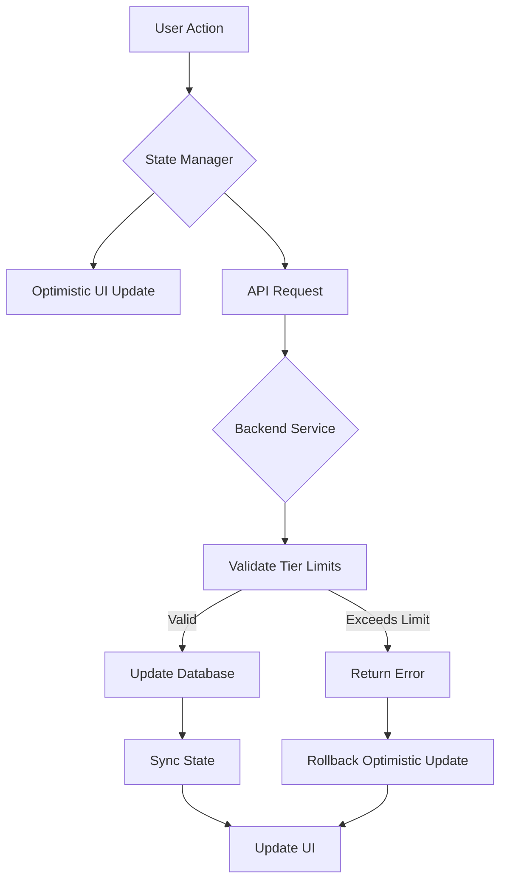
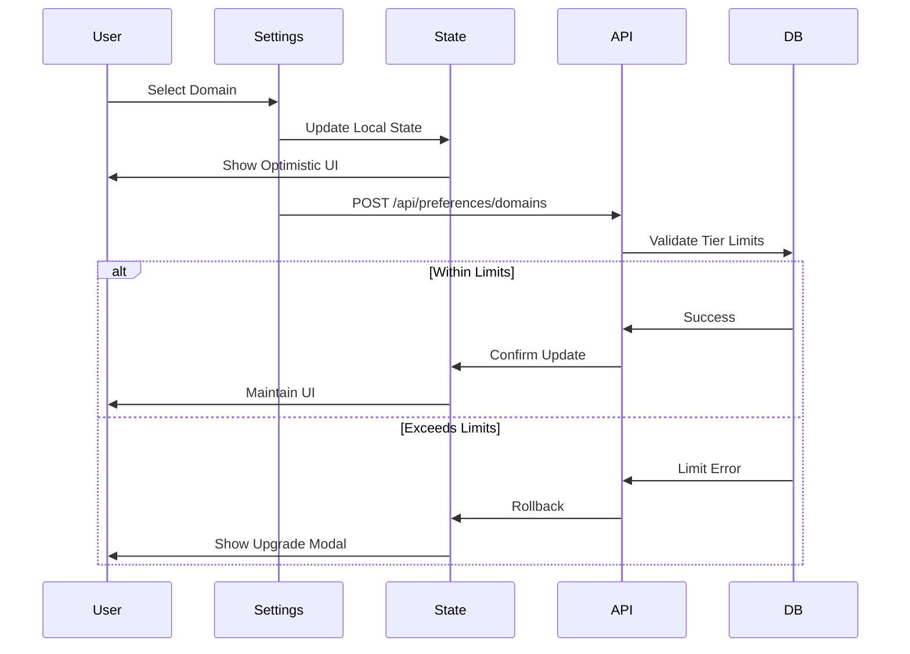
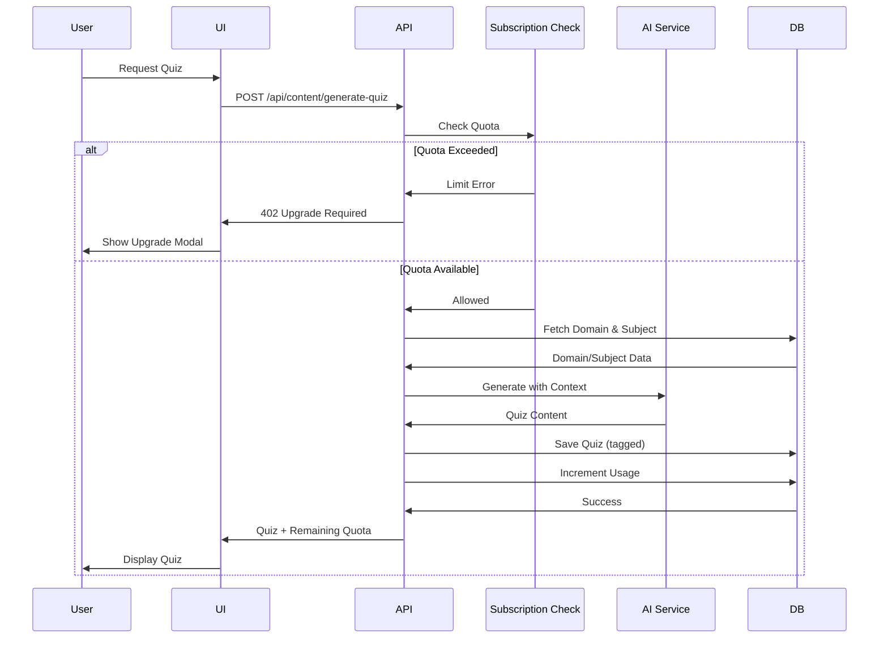
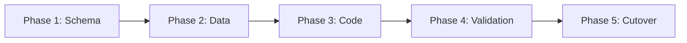

# Design Document: Multi-Domain Learning Platform

## Overview

This document provides the comprehensive technical design for transforming PrepBud from a medical-focused learning application into a multi-domain AI-powered learning platform. The transformation maintains backwards compatibility while introducing scalable, domain-agnostic features that support Medical, Engineering, Business, Law, Science, Technology, Humanities, and custom domains.

### Design Goals

1. **Multi-Domain Architecture**: Enable users to select and manage multiple learning domains simultaneously with isolated data and preferences per domain
2. **Backwards Compatibility**: Preserve all existing functionality and data for medical users without disruption
3. **Scalable Data Model**: Design database schema that efficiently supports domain-specific and cross-domain queries
4. **Performance**: Maintain sub-second response times for preference updates and content filtering
5. **Premium UX**: Deliver smooth animations, responsive design, and intuitive interactions comparable to leading SaaS platforms
6. **Subscription Management**: Implement tiered access control with automated enforcement of usage limits
7. **State Consistency**: Ensure synchronized state across all components with optimistic updates and rollback capability

### Technology Stack

- **Frontend**: Next.js 16.2.9 with React 19.2.4, TypeScript 5
- **State Management**: Zustand 5.0.14 for client-side state
- **Database**: Supabase PostgreSQL with @supabase/supabase-js 2.108.2
- **UI Components**: Radix UI primitives with Tailwind CSS 4
- **Animations**: Motion (Framer Motion) 12.40.0
- **Data Fetching**: TanStack React Query 5.101.0
- **Forms**: React Hook Form 7.79.0 with Zod 4.4.3 validation
- **AI Integration**: Existing LangChain/OpenAI integration maintained

### Key Design Principles

1. **Domain-First Design**: All content and preferences are organized by domain and subject hierarchies
2. **Optimistic UI**: Immediate feedback with background persistence and rollback on failure
3. **Progressive Enhancement**: Core functionality works without JavaScript; enhanced features require it
4. **Accessibility First**: WCAG 2.1 AA compliance with keyboard navigation and screen reader support
5. **Mobile-First Responsive**: Design starts at 320px viewport and scales to desktop
6. **Type Safety**: Comprehensive TypeScript types for all data structures and API contracts


## Architecture

### System Architecture Overview

The platform follows a layered architecture with clear separation of concerns:

```
┌─────────────────────────────────────────────────────────────┐
│                     Presentation Layer                       │
│  (Next.js Pages, React Components, UI Adapters)             │
└─────────────────────────────────────────────────────────────┘
                              ↓
┌─────────────────────────────────────────────────────────────┐
│                   Application Layer                          │
│  (Hooks, State Management, Business Logic)                  │
└─────────────────────────────────────────────────────────────┘
                              ↓
┌─────────────────────────────────────────────────────────────┐
│                      API Layer                               │
│  (Next.js API Routes, Supabase Client, Query Handlers)      │
└─────────────────────────────────────────────────────────────┘
                              ↓
┌─────────────────────────────────────────────────────────────┐
│                    Data Layer                                │
│  (PostgreSQL, Supabase Auth, Storage)                       │
└─────────────────────────────────────────────────────────────┘
```

### Multi-Domain Data Flow



### Domain Management Flow



### Component Architecture

The application is structured into feature-based modules:

```
src/
├── app/                          # Next.js App Router pages
│   ├── (dashboard)/             # Authenticated routes
│   │   ├── dashboard/           # Main dashboard
│   │   ├── subjects/            # Subject management
│   │   ├── quizzes/             # Quiz list and detail
│   │   ├── summaries/           # Summary list and detail
│   │   ├── ai-assistant/        # Chat interface
│   │   ├── subscription/        # Pricing and billing
│   │   ├── settings/            # User preferences
│   │   └── profile/             # User profile
│   ├── (auth)/                  # Auth routes
│   └── api/                     # API routes
│       ├── preferences/         # Preference management
│       ├── domains/             # Domain operations
│       ├── subjects/            # Subject operations
│       ├── content/             # Content generation
│       └── subscription/        # Subscription management
├── components/
│   ├── domains/                 # Domain selection components
│   ├── subjects/                # Subject management components
│   ├── subscription/            # Subscription UI components
│   ├── filters/                 # Content filtering components
│   └── ui/                      # Shared UI primitives
├── lib/
│   ├── stores/                  # Zustand stores
│   │   ├── preferences-store.ts
│   │   ├── domains-store.ts
│   │   └── subscription-store.ts
│   ├── hooks/                   # Custom React hooks
│   ├── api/                     # API client functions
│   └── utils/                   # Utility functions
└── types/
    ├── database.types.ts        # Generated Supabase types
    ├── domain.types.ts          # Domain-specific types
    └── subscription.types.ts    # Subscription types
```

### State Management Architecture

The application uses Zustand for client-side state management with the following stores:

1. **Preferences Store**: Manages user preferences including domains, subjects, UI settings
2. **Subscription Store**: Tracks subscription tier, usage limits, and billing information
3. **Content Store**: Manages filtered content lists with pagination
4. **UI Store**: Handles UI state like modals, toasts, loading states

Each store follows the pattern:
- Optimistic updates for immediate UI feedback
- Background API synchronization
- Automatic rollback on errors
- Persistent caching in localStorage for offline support


## Components and Interfaces

### Core Components

#### 1. Domain Selector Component

**Purpose**: Allow users to select and manage their learning domains

**Props Interface**:
```typescript
interface DomainSelectorProps {
  selectedDomains: string[];          // Array of domain IDs
  onSelectionChange: (domains: string[]) => void;
  maxSelections: number;              // Based on subscription tier
  showUpgradePrompt?: boolean;        // Show upgrade CTA
  variant?: 'grid' | 'list';          // Layout variant
}
```

**Key Features**:
- Visual cards for each predefined domain (Medical, Engineering, Business, Law, Science, Technology, Humanities)
- Custom domain creation with inline validation
- Selected state indication with checkmark and color change
- Disabled state for domains beyond tier limit
- Responsive grid layout (1 column mobile, 2 tablet, 3 desktop)

**State Management**:
- Uses optimistic updates via preferences store
- Displays loading spinner during persistence
- Shows error toast and reverts on failure

---

#### 2. Subject Toggle Panel Component

**Purpose**: Manage subject selections within each domain

**Props Interface**:
```typescript
interface SubjectTogglePanelProps {
  domains: Domain[];                   // Available domains
  selectedSubjects: SubjectSelection[]; // Current selections
  onToggle: (subjectId: string, enabled: boolean) => void;
  groupByDomain?: boolean;             // Group subjects by domain
  showEnabledCount?: boolean;          // Show enabled count badge
}

interface SubjectSelection {
  subjectId: string;
  domainId: string;
  enabled: boolean;
}
```

**Key Features**:
- Accordion layout grouped by domain
- Toggle switches for each subject
- Visual count of enabled subjects per domain
- Search and filter functionality
- Bulk enable/disable per domain

---

#### 3. Subscription Card Component

**Purpose**: Display subscription tier information and upgrade options

**Props Interface**:
```typescript
interface SubscriptionCardProps {
  tier: 'free' | 'pro' | 'premium';
  pricing: number;                     // Monthly cost in USD
  features: FeatureList;
  isCurrentPlan: boolean;
  isRecommended?: boolean;
  onActionClick: () => void;
  actionLabel: string;                 // "Upgrade", "Downgrade", "Current Plan"
}

interface FeatureList {
  domains: number;
  subjects: number | 'unlimited';
  quizzes: number;
  summaries: string[];                 // Summary types available
}
```

**Key Features**:
- Visual differentiation for recommended plan
- Feature comparison list with checkmarks
- Prominent CTA button
- Responsive card layout
- Accessibility: proper heading hierarchy, keyboard navigation

---

#### 4. Content Filter Component

**Purpose**: Filter quizzes and summaries by domain and subject

**Props Interface**:
```typescript
interface ContentFilterProps {
  availableDomains: Domain[];
  availableSubjects: Subject[];
  selectedFilters: FilterState;
  onFilterChange: (filters: FilterState) => void;
  resultCount: number;
  variant?: 'sidebar' | 'drawer';      // Layout for mobile vs desktop
}

interface FilterState {
  domains: string[];                   // Selected domain IDs
  subjects: string[];                  // Selected subject IDs
}
```

**Key Features**:
- Multi-select domain chips
- Nested subject selection per domain
- Clear all filters action
- Result count display
- Mobile: slide-out drawer; Desktop: sidebar panel

---

#### 5. Upgrade Modal Component

**Purpose**: Prompt users to upgrade when they hit tier limits

**Props Interface**:
```typescript
interface UpgradeModalProps {
  isOpen: boolean;
  onClose: () => void;
  limitType: 'domains' | 'subjects' | 'quizzes' | 'summaries';
  currentUsage: number;
  currentLimit: number;
  recommendedTier: 'pro' | 'premium';
}
```

**Key Features**:
- Non-dismissible when triggered by limit enforcement
- Clear explanation of limit reached
- Usage progress bar
- Direct link to subscription page
- Comparison of current vs upgraded limits

---

#### 6. Domain Adapter HOC

**Purpose**: Wrap components to apply domain-specific styling and terminology

**Type Interface**:
```typescript
function withDomainAdapter<P extends object>(
  Component: React.ComponentType<P>,
  adaptations: DomainAdaptations
): React.ComponentType<P & { domain?: Domain }>;

interface DomainAdaptations {
  terminology: Record<string, string>;  // Term mapping
  colorScheme: ColorScheme;
  iconSet: IconSet;
}
```

**Key Features**:
- Automatic terminology replacement based on domain
- Theme application (colors, icons)
- Graceful fallback to neutral styling for multiple domains
- Memoized for performance

---

### Hook Interfaces

#### usePreferences Hook

```typescript
interface UsePreferencesReturn {
  preferences: UserPreferences;
  isLoading: boolean;
  error: Error | null;
  updateDomains: (domains: string[]) => Promise<void>;
  updateSubjects: (subjects: SubjectSelection[]) => Promise<void>;
  updateUISettings: (settings: UISettings) => Promise<void>;
  resetToDefaults: () => Promise<void>;
}

interface UserPreferences {
  domains: string[];
  subjects: SubjectSelection[];
  uiSettings: UISettings;
  lastSyncedAt: Date;
}

interface UISettings {
  theme: 'light' | 'dark' | 'system';
  language: 'en' | 'es' | 'fr' | 'de';
  displayDensity: 'compact' | 'standard' | 'comfortable';
  notifications: NotificationPreferences;
}
```

---

#### useSubscription Hook

```typescript
interface UseSubscriptionReturn {
  subscription: SubscriptionInfo;
  usage: UsageStats;
  isLoading: boolean;
  canPerformAction: (action: ActionType) => boolean;
  getUpgradePrompt: (action: ActionType) => UpgradePromptData | null;
  navigateToCheckout: (tier: SubscriptionTier) => void;
}

interface SubscriptionInfo {
  tier: 'free' | 'pro' | 'premium';
  billingPeriodStart: Date;
  billingPeriodEnd: Date;
  autoRenew: boolean;
}

interface UsageStats {
  domains: { current: number; limit: number };
  subjects: { current: number; limit: number };
  quizzes: { current: number; limit: number; resetsAt: Date };
  summaries: { current: number; limit: number; resetsAt: Date };
}

type ActionType = 
  | 'add_domain' 
  | 'add_subject' 
  | 'generate_quiz' 
  | 'generate_summary';
```

---

#### useContentFilters Hook

```typescript
interface UseContentFiltersReturn {
  filters: FilterState;
  setFilters: (filters: Partial<FilterState>) => void;
  clearFilters: () => void;
  filteredContent: Content[];
  isFiltering: boolean;
  resultCount: number;
}
```

---

### API Endpoint Interfaces

#### POST /api/preferences/domains

**Request**:
```typescript
{
  domains: string[];              // Array of domain IDs
  userId: string;
}
```

**Response**:
```typescript
{
  success: boolean;
  preferences: UserPreferences;
  errors?: ValidationError[];
}
```

---

#### POST /api/preferences/subjects

**Request**:
```typescript
{
  subjects: SubjectSelection[];
  userId: string;
}
```

**Response**:
```typescript
{
  success: boolean;
  preferences: UserPreferences;
  errors?: ValidationError[];
}
```

---

#### GET /api/subscription/status

**Response**:
```typescript
{
  subscription: SubscriptionInfo;
  usage: UsageStats;
  limits: TierLimits;
}
```

---

#### POST /api/subscription/upgrade

**Request**:
```typescript
{
  targetTier: 'pro' | 'premium';
  userId: string;
}
```

**Response**:
```typescript
{
  checkoutUrl: string;
  sessionId: string;
}
```

---

#### GET /api/content/filtered

**Query Parameters**:
```typescript
{
  type: 'quiz' | 'summary';
  domains?: string[];               // Filter by domains
  subjects?: string[];              // Filter by subjects
  page?: number;
  pageSize?: number;
}
```

**Response**:
```typescript
{
  content: Content[];
  pagination: {
    page: number;
    pageSize: number;
    total: number;
    hasMore: boolean;
  };
  filters: {
    domains: string[];
    subjects: string[];
  };
}
```


## Data Models

### Database Schema

#### New Tables

##### `domains` Table

Stores predefined and custom domain definitions.

```sql
CREATE TABLE domains (
  domain_id UUID PRIMARY KEY DEFAULT gen_random_uuid(),
  name VARCHAR(100) NOT NULL,
  description VARCHAR(500),
  icon_name VARCHAR(50),
  is_predefined BOOLEAN DEFAULT false,
  created_by UUID REFERENCES auth.users(id),
  created_at TIMESTAMPTZ DEFAULT NOW(),
  updated_at TIMESTAMPTZ DEFAULT NOW(),
  CONSTRAINT unique_domain_name UNIQUE (name, created_by)
);

CREATE INDEX idx_domains_created_by ON domains(created_by);
CREATE INDEX idx_domains_is_predefined ON domains(is_predefined);
```

**Predefined Domains** (inserted via migration):
- Medical
- Engineering
- Business
- Law
- Science
- Technology
- Humanities

---

##### `user_domains` Junction Table

Tracks which domains each user has selected.

```sql
CREATE TABLE user_domains (
  user_id UUID REFERENCES auth.users(id) ON DELETE CASCADE,
  domain_id UUID REFERENCES domains(domain_id) ON DELETE CASCADE,
  selected_at TIMESTAMPTZ DEFAULT NOW(),
  PRIMARY KEY (user_id, domain_id)
);

CREATE INDEX idx_user_domains_user ON user_domains(user_id);
CREATE INDEX idx_user_domains_domain ON user_domains(domain_id);
```

---

##### `subjects` Table

Stores subjects within each domain.

```sql
CREATE TABLE subjects (
  subject_id UUID PRIMARY KEY DEFAULT gen_random_uuid(),
  domain_id UUID NOT NULL REFERENCES domains(domain_id) ON DELETE RESTRICT,
  name VARCHAR(100) NOT NULL,
  description VARCHAR(500),
  created_at TIMESTAMPTZ DEFAULT NOW(),
  updated_at TIMESTAMPTZ DEFAULT NOW(),
  CONSTRAINT unique_subject_per_domain UNIQUE (domain_id, name)
);

CREATE INDEX idx_subjects_domain ON subjects(domain_id);
```

**Example Subjects by Domain**:

*Medical*: Anatomy, Physiology, Pharmacology, Pathology, Biochemistry, Microbiology, etc.

*Engineering*: Calculus, Linear Algebra, Physics, Circuit Analysis, Thermodynamics, Statics, etc.

*Business*: Accounting, Finance, Marketing, Operations, Strategy, Economics, etc.

*Law*: Constitutional Law, Contract Law, Criminal Law, Torts, Civil Procedure, etc.

*Science*: Chemistry, Biology, Physics, Geology, Astronomy, etc.

*Technology*: Programming, Data Structures, Algorithms, Databases, Networks, Security, etc.

*Humanities*: History, Philosophy, Literature, Languages, Art, Music, etc.

---

##### `user_subjects` Junction Table

Tracks which subjects are enabled for each user.

```sql
CREATE TABLE user_subjects (
  user_id UUID REFERENCES auth.users(id) ON DELETE CASCADE,
  subject_id UUID REFERENCES subjects(subject_id) ON DELETE CASCADE,
  enabled_at TIMESTAMPTZ DEFAULT NOW(),
  PRIMARY KEY (user_id, subject_id)
);

CREATE INDEX idx_user_subjects_user ON user_subjects(user_id);
CREATE INDEX idx_user_subjects_subject ON user_subjects(subject_id);
```

---

##### `subscriptions` Table

Tracks user subscription information.

```sql
CREATE TABLE subscriptions (
  id UUID PRIMARY KEY DEFAULT gen_random_uuid(),
  user_id UUID NOT NULL REFERENCES auth.users(id) ON DELETE CASCADE,
  tier VARCHAR(20) NOT NULL CHECK (tier IN ('free', 'pro', 'premium')),
  billing_period_start TIMESTAMPTZ NOT NULL,
  billing_period_end TIMESTAMPTZ NOT NULL,
  auto_renew BOOLEAN DEFAULT true,
  stripe_subscription_id VARCHAR(255),
  stripe_customer_id VARCHAR(255),
  created_at TIMESTAMPTZ DEFAULT NOW(),
  updated_at TIMESTAMPTZ DEFAULT NOW(),
  CONSTRAINT unique_user_subscription UNIQUE (user_id)
);

CREATE INDEX idx_subscriptions_user ON subscriptions(user_id);
CREATE INDEX idx_subscriptions_tier ON subscriptions(tier);
CREATE INDEX idx_subscriptions_stripe ON subscriptions(stripe_subscription_id);
```

---

##### `usage_tracking` Table

Tracks resource usage per billing period.

```sql
CREATE TABLE usage_tracking (
  id UUID PRIMARY KEY DEFAULT gen_random_uuid(),
  user_id UUID NOT NULL REFERENCES auth.users(id) ON DELETE CASCADE,
  billing_period_start TIMESTAMPTZ NOT NULL,
  billing_period_end TIMESTAMPTZ NOT NULL,
  quiz_count INTEGER DEFAULT 0,
  summary_count INTEGER DEFAULT 0,
  domain_count INTEGER DEFAULT 0,
  subject_count INTEGER DEFAULT 0,
  created_at TIMESTAMPTZ DEFAULT NOW(),
  updated_at TIMESTAMPTZ DEFAULT NOW(),
  CONSTRAINT unique_user_period UNIQUE (user_id, billing_period_start)
);

CREATE INDEX idx_usage_tracking_user ON usage_tracking(user_id);
CREATE INDEX idx_usage_tracking_period ON usage_tracking(billing_period_start, billing_period_end);
```

---

#### Modified Tables

##### `profiles` Table Updates

Add new fields for UI preferences:

```sql
ALTER TABLE profiles ADD COLUMN theme VARCHAR(20) DEFAULT 'system' CHECK (theme IN ('light', 'dark', 'system'));
ALTER TABLE profiles ADD COLUMN language VARCHAR(5) DEFAULT 'en' CHECK (language IN ('en', 'es', 'fr', 'de'));
ALTER TABLE profiles ADD COLUMN display_density VARCHAR(20) DEFAULT 'standard' CHECK (display_density IN ('compact', 'standard', 'comfortable'));
ALTER TABLE profiles ADD COLUMN notification_email BOOLEAN DEFAULT true;
ALTER TABLE profiles ADD COLUMN notification_push BOOLEAN DEFAULT true;
ALTER TABLE profiles ADD COLUMN notification_in_app BOOLEAN DEFAULT true;
```

---

##### `quizzes` Table Updates

Add domain and subject tagging:

```sql
ALTER TABLE quizzes ADD COLUMN domain_id UUID REFERENCES domains(domain_id) ON DELETE SET NULL;
ALTER TABLE quizzes ADD COLUMN subject_id UUID REFERENCES subjects(subject_id) ON DELETE SET NULL;

CREATE INDEX idx_quizzes_domain ON quizzes(domain_id);
CREATE INDEX idx_quizzes_subject ON quizzes(subject_id);
```

---

##### `summaries` Table Updates

Add domain and subject tagging:

```sql
ALTER TABLE summaries ADD COLUMN domain_id UUID REFERENCES domains(domain_id) ON DELETE SET NULL;
ALTER TABLE summaries ADD COLUMN subject_id UUID REFERENCES subjects(subject_id) ON DELETE SET NULL;

CREATE INDEX idx_summaries_domain ON summaries(domain_id);
CREATE INDEX idx_summaries_subject ON summaries(subject_id);
```

---

##### `tasks` Table Updates

Add optional domain and subject associations:

```sql
ALTER TABLE tasks ADD COLUMN domain_id UUID REFERENCES domains(domain_id) ON DELETE SET NULL;
ALTER TABLE tasks ADD COLUMN subject_id UUID REFERENCES subjects(subject_id) ON DELETE SET NULL;

CREATE INDEX idx_tasks_domain ON tasks(domain_id);
CREATE INDEX idx_tasks_subject ON tasks(subject_id);
```

---

##### `subject_analytics` Table Updates

Modify to support multi-domain analytics:

```sql
ALTER TABLE subject_analytics DROP COLUMN subject;
ALTER TABLE subject_analytics ADD COLUMN domain_id UUID REFERENCES domains(domain_id) ON DELETE CASCADE;
ALTER TABLE subject_analytics ADD COLUMN subject_id UUID REFERENCES subjects(subject_id) ON DELETE CASCADE;

CREATE INDEX idx_subject_analytics_domain ON subject_analytics(domain_id);
CREATE INDEX idx_subject_analytics_subject ON subject_analytics(subject_id);
```

---

### TypeScript Type Definitions

#### Domain Types

```typescript
// Domain entity
export interface Domain {
  domain_id: string;
  name: string;
  description: string | null;
  icon_name: string | null;
  is_predefined: boolean;
  created_by: string | null;
  created_at: string;
  updated_at: string;
}

// Subject entity
export interface Subject {
  subject_id: string;
  domain_id: string;
  name: string;
  description: string | null;
  created_at: string;
  updated_at: string;
}

// User domain selection
export interface UserDomain {
  user_id: string;
  domain_id: string;
  selected_at: string;
}

// User subject selection
export interface UserSubject {
  user_id: string;
  subject_id: string;
  enabled_at: string;
}
```

---

#### Subscription Types

```typescript
// Subscription tiers
export type SubscriptionTier = 'free' | 'pro' | 'premium';

// Subscription entity
export interface Subscription {
  id: string;
  user_id: string;
  tier: SubscriptionTier;
  billing_period_start: string;
  billing_period_end: string;
  auto_renew: boolean;
  stripe_subscription_id: string | null;
  stripe_customer_id: string | null;
  created_at: string;
  updated_at: string;
}

// Tier limits configuration
export interface TierLimits {
  domains: number;
  subjects: number;
  quizzes: number;
  summaries: number;
  summaryTypes: SummaryTypeEnum[];
}

export const TIER_LIMITS: Record<SubscriptionTier, TierLimits> = {
  free: {
    domains: 1,
    subjects: 3,
    quizzes: 5,
    summaries: 5,
    summaryTypes: ['quick', 'revision']
  },
  pro: {
    domains: 3,
    subjects: 10000,
    quizzes: 50,
    summaries: 50,
    summaryTypes: ['quick', 'revision', 'cheat_sheet', 'key_concepts', 'definitions']
  },
  premium: {
    domains: 10,
    subjects: 10000,
    quizzes: 500,
    summaries: 500,
    summaryTypes: [
      'quick', 'revision', 'cheat_sheet', 'key_concepts', 
      'definitions', 'flashcards', 'high_yield_points', 
      'exam_notes', 'one_page_summary', 'active_recall_notes'
    ]
  }
};

// Usage tracking entity
export interface UsageTracking {
  id: string;
  user_id: string;
  billing_period_start: string;
  billing_period_end: string;
  quiz_count: number;
  summary_count: number;
  domain_count: number;
  subject_count: number;
  created_at: string;
  updated_at: string;
}
```

---

#### Preference Types

```typescript
// User preferences aggregate
export interface UserPreferences {
  domains: Domain[];
  subjects: SubjectWithDomain[];
  uiSettings: UISettings;
}

// Subject with domain context
export interface SubjectWithDomain extends Subject {
  domain: Domain;
  enabled: boolean;
}

// UI settings
export interface UISettings {
  theme: 'light' | 'dark' | 'system';
  language: 'en' | 'es' | 'fr' | 'de';
  display_density: 'compact' | 'standard' | 'comfortable';
  notifications: {
    email: boolean;
    push: boolean;
    inApp: boolean;
  };
}
```

---

### Database Views

For optimized queries, create materialized views:

#### `user_preferences_view`

```sql
CREATE MATERIALIZED VIEW user_preferences_view AS
SELECT 
  ud.user_id,
  json_agg(DISTINCT d.*) FILTER (WHERE d.domain_id IS NOT NULL) AS domains,
  json_agg(DISTINCT jsonb_build_object(
    'subject_id', s.subject_id,
    'domain_id', s.domain_id,
    'name', s.name,
    'description', s.description,
    'enabled', us.subject_id IS NOT NULL
  )) FILTER (WHERE s.subject_id IS NOT NULL) AS subjects
FROM user_domains ud
LEFT JOIN domains d ON d.domain_id = ud.domain_id
LEFT JOIN subjects s ON s.domain_id = d.domain_id
LEFT JOIN user_subjects us ON us.subject_id = s.subject_id AND us.user_id = ud.user_id
GROUP BY ud.user_id;

CREATE UNIQUE INDEX ON user_preferences_view(user_id);
```

Refresh strategy: Trigger refresh on preference changes via database triggers.


## State Management Architecture

### Zustand Store Design

#### Preferences Store

**File**: `src/lib/stores/preferences-store.ts`

```typescript
interface PreferencesState {
  // State
  preferences: UserPreferences | null;
  isLoading: boolean;
  error: Error | null;
  lastSyncedAt: Date | null;
  pendingUpdates: PendingUpdate[];

  // Actions
  loadPreferences: (userId: string) => Promise<void>;
  updateDomains: (domains: string[]) => Promise<void>;
  updateSubjects: (subjects: SubjectSelection[]) => Promise<void>;
  updateUISettings: (settings: Partial<UISettings>) => Promise<void>;
  resetToDefaults: () => Promise<void>;
  
  // Internal
  _setPreferences: (preferences: UserPreferences) => void;
  _rollback: (updateId: string) => void;
}

interface PendingUpdate {
  id: string;
  type: 'domains' | 'subjects' | 'ui_settings';
  previousValue: unknown;
  newValue: unknown;
  timestamp: Date;
}
```

**Key Behaviors**:
1. **Optimistic Updates**: Immediately update local state, then sync to backend
2. **Automatic Rollback**: If backend fails, revert to previous state and show error
3. **Debounced Persistence**: Batch rapid updates within 500ms window
4. **Local Storage Backup**: Cache preferences in localStorage for offline access
5. **Automatic Refresh**: Poll for changes every 5 minutes when tab is active

**Implementation Pattern**:
```typescript
const usePreferencesStore = create<PreferencesState>((set, get) => ({
  preferences: null,
  isLoading: false,
  error: null,
  lastSyncedAt: null,
  pendingUpdates: [],

  updateDomains: async (domains: string[]) => {
    const updateId = crypto.randomUUID();
    const previousValue = get().preferences?.domains;

    // Optimistic update
    set((state) => ({
      preferences: state.preferences 
        ? { ...state.preferences, domains }
        : null,
      pendingUpdates: [...state.pendingUpdates, {
        id: updateId,
        type: 'domains',
        previousValue,
        newValue: domains,
        timestamp: new Date()
      }]
    }));

    try {
      // Backend sync
      const response = await api.updateDomains(domains);
      
      // Remove pending update on success
      set((state) => ({
        pendingUpdates: state.pendingUpdates.filter(u => u.id !== updateId),
        lastSyncedAt: new Date()
      }));

      return response;
    } catch (error) {
      // Rollback on failure
      get()._rollback(updateId);
      throw error;
    }
  },

  _rollback: (updateId: string) => {
    set((state) => {
      const update = state.pendingUpdates.find(u => u.id === updateId);
      if (!update || !state.preferences) return state;

      return {
        preferences: {
          ...state.preferences,
          [update.type === 'domains' ? 'domains' : 
           update.type === 'subjects' ? 'subjects' : 
           'uiSettings']: update.previousValue
        },
        pendingUpdates: state.pendingUpdates.filter(u => u.id !== updateId),
        error: new Error('Update failed - changes reverted')
      };
    });
  }
}));
```

---

#### Subscription Store

**File**: `src/lib/stores/subscription-store.ts`

```typescript
interface SubscriptionState {
  // State
  subscription: Subscription | null;
  usage: UsageStats | null;
  limits: TierLimits | null;
  isLoading: boolean;
  error: Error | null;

  // Actions
  loadSubscription: (userId: string) => Promise<void>;
  checkLimit: (action: ActionType) => LimitCheckResult;
  incrementUsage: (type: 'quiz' | 'summary') => Promise<void>;
  navigateToCheckout: (tier: SubscriptionTier) => void;
  
  // Computed
  getRemainingQuota: (type: 'domains' | 'subjects' | 'quizzes' | 'summaries') => number;
  getUsagePercentage: (type: 'domains' | 'subjects' | 'quizzes' | 'summaries') => number;
}

interface LimitCheckResult {
  allowed: boolean;
  reason?: string;
  currentUsage: number;
  limit: number;
  upgradeRequired?: SubscriptionTier;
}
```

**Key Behaviors**:
1. **Pre-Action Validation**: Check limits before allowing resource creation
2. **Real-Time Usage Tracking**: Increment counters after successful operations
3. **Billing Period Awareness**: Auto-reset counters at period boundaries
4. **Upgrade Prompts**: Generate contextual upgrade messages based on limit type

---

#### Content Store

**File**: `src/lib/stores/content-store.ts`

```typescript
interface ContentState {
  // State
  quizzes: Quiz[];
  summaries: Summary[];
  filters: FilterState;
  isLoading: boolean;
  pagination: PaginationState;

  // Actions
  loadContent: (type: 'quiz' | 'summary') => Promise<void>;
  applyFilters: (filters: Partial<FilterState>) => void;
  clearFilters: () => void;
  loadMore: () => Promise<void>;
  
  // Selectors
  getFilteredQuizzes: () => Quiz[];
  getFilteredSummaries: () => Summary[];
}

interface FilterState {
  domains: string[];
  subjects: string[];
  searchQuery: string;
}

interface PaginationState {
  page: number;
  pageSize: number;
  total: number;
  hasMore: boolean;
}
```

**Key Behaviors**:
1. **Client-Side Filtering**: Filter loaded content without additional API calls
2. **Infinite Scroll Support**: Load more content as user scrolls
3. **Search Integration**: Combined filter and search functionality
4. **Filter Persistence**: Maintain filters in session storage per page

---

### Local Storage Strategy

**Keys**:
- `preferences_{userId}`: Cached user preferences
- `subscription_{userId}`: Cached subscription data
- `filters_quizzes`: Quiz page filters (session only)
- `filters_summaries`: Summary page filters (session only)

**Sync Strategy**:
1. Load from localStorage on mount (instant UI)
2. Fetch from backend in background
3. Update localStorage on every successful sync
4. Clear on logout

**Storage Limits**:
- Maximum 5MB per domain
- Compress JSON with gzip for large datasets
- Implement LRU eviction if approaching limits


## API Endpoint Design

### Preference Management Endpoints

#### GET /api/preferences

**Purpose**: Load all user preferences

**Authentication**: Required (user JWT)

**Response**:
```typescript
{
  success: true,
  data: {
    domains: Domain[],
    subjects: SubjectWithDomain[],
    uiSettings: UISettings
  },
  meta: {
    lastSyncedAt: string,
    version: number
  }
}
```

**Caching**: Cache-Control: private, max-age=300

---

#### POST /api/preferences/domains

**Purpose**: Update user's selected domains

**Request Body**:
```typescript
{
  domains: string[]  // Array of domain IDs
}
```

**Validation**:
- Check subscription tier limits
- Validate domain IDs exist
- Ensure at least one domain selected

**Response**:
```typescript
{
  success: true,
  data: {
    domains: Domain[],
    subjects: SubjectWithDomain[]  // Updated subject list
  },
  warnings?: string[]  // e.g., "Some subjects were disabled"
}
```

**Error Responses**:
- 400: Validation error (invalid domain IDs, empty selection)
- 402: Tier limit exceeded (with upgrade prompt data)
- 500: Database error

---

#### POST /api/preferences/subjects

**Purpose**: Update user's enabled subjects

**Request Body**:
```typescript
{
  subjects: Array<{
    subjectId: string,
    enabled: boolean
  }>
}
```

**Validation**:
- Validate all subject IDs exist
- Ensure at least one subject enabled across all domains
- Check subscription tier limits

**Response**:
```typescript
{
  success: true,
  data: {
    subjects: SubjectWithDomain[]
  }
}
```

---

#### PATCH /api/preferences/ui-settings

**Purpose**: Update UI customization settings

**Request Body**:
```typescript
{
  theme?: 'light' | 'dark' | 'system',
  language?: 'en' | 'es' | 'fr' | 'de',
  displayDensity?: 'compact' | 'standard' | 'comfortable',
  notifications?: {
    email?: boolean,
    push?: boolean,
    inApp?: boolean
  }
}
```

**Response**:
```typescript
{
  success: true,
  data: {
    uiSettings: UISettings
  }
}
```

---

### Subscription Management Endpoints

#### GET /api/subscription/status

**Purpose**: Get current subscription info and usage

**Response**:
```typescript
{
  success: true,
  data: {
    subscription: {
      tier: 'free' | 'pro' | 'premium',
      billingPeriodStart: string,
      billingPeriodEnd: string,
      autoRenew: boolean
    },
    usage: {
      domains: { current: number, limit: number },
      subjects: { current: number, limit: number },
      quizzes: { current: number, limit: number, resetsAt: string },
      summaries: { current: number, limit: number, resetsAt: string }
    },
    limits: TierLimits
  }
}
```

---

#### POST /api/subscription/checkout

**Purpose**: Initiate upgrade checkout flow

**Request Body**:
```typescript
{
  targetTier: 'pro' | 'premium',
  returnUrl?: string
}
```

**Response**:
```typescript
{
  success: true,
  data: {
    checkoutUrl: string,      // Stripe checkout URL
    sessionId: string
  }
}
```

**Flow**:
1. Create Stripe checkout session
2. Store pending subscription change
3. Redirect user to Stripe
4. Webhook handles completion

---

#### POST /api/subscription/downgrade

**Purpose**: Schedule downgrade at period end

**Request Body**:
```typescript
{
  targetTier: 'free' | 'pro'
}
```

**Response**:
```typescript
{
  success: true,
  data: {
    effectiveDate: string,    // When downgrade takes effect
    warnings: string[]        // e.g., "3 domains will be removed"
  }
}
```

---

### Content Management Endpoints

#### GET /api/content/quizzes

**Purpose**: Fetch filtered quizzes

**Query Parameters**:
```typescript
{
  domains?: string[],           // Filter by domains
  subjects?: string[],          // Filter by subjects
  page?: number,
  pageSize?: number,
  sortBy?: 'created_at' | 'title' | 'difficulty',
  sortOrder?: 'asc' | 'desc'
}
```

**Response**:
```typescript
{
  success: true,
  data: {
    quizzes: Quiz[],
    pagination: {
      page: number,
      pageSize: number,
      total: number,
      hasMore: boolean
    }
  }
}
```

**Performance**: Use indexed queries on domain_id and subject_id

---

#### GET /api/content/summaries

**Purpose**: Fetch filtered summaries

Similar structure to quizzes endpoint.

---

#### POST /api/content/generate-quiz

**Purpose**: Generate new quiz with domain/subject tagging

**Request Body**:
```typescript
{
  domainId: string,
  subjectId: string,
  difficulty: 'easy' | 'medium' | 'hard',
  numQuestions: number,
  sourceText?: string,
  noteId?: string
}
```

**Validation**:
- Check subscription quota
- Validate domain/subject belong to user's selections
- Validate sourceText or noteId provided

**Response**:
```typescript
{
  success: true,
  data: {
    quiz: Quiz,
    remainingQuota: number
  }
}
```

**Process**:
1. Check tier limits (abort if exceeded)
2. Validate domain/subject selections
3. Generate quiz via AI with domain context
4. Tag quiz with domain/subject
5. Increment usage counter
6. Return quiz and updated quota

---

#### POST /api/content/generate-summary

**Purpose**: Generate summary with domain/subject tagging

**Request Body**:
```typescript
{
  domainId: string,
  subjectId: string,
  type: SummaryTypeEnum,
  sourceText?: string,
  noteId?: string
}
```

**Validation**:
- Check subscription quota and tier access to summary type
- Validate domain/subject selections

**Response**:
```typescript
{
  success: true,
  data: {
    summary: Summary,
    remainingQuota: number
  }
}
```

---

### Domain Management Endpoints

#### GET /api/domains

**Purpose**: List all available domains (predefined + user's custom)

**Response**:
```typescript
{
  success: true,
  data: {
    predefined: Domain[],
    custom: Domain[]
  }
}
```

---

#### POST /api/domains/custom

**Purpose**: Create custom domain

**Request Body**:
```typescript
{
  name: string,           // 1-50 characters
  description?: string    // Max 500 characters
}
```

**Validation**:
- Name length 1-50 characters
- Valid characters (letters, numbers, spaces, hyphens)
- Max 10 custom domains per user
- Unique name per user

**Response**:
```typescript
{
  success: true,
  data: {
    domain: Domain
  }
}
```

---

#### GET /api/subjects

**Purpose**: List subjects for selected domains

**Query Parameters**:
```typescript
{
  domainIds: string[]     // Filter subjects by domains
}
```

**Response**:
```typescript
{
  success: true,
  data: {
    subjects: SubjectWithDomain[]
  }
}
```

---

### Analytics Endpoints

#### GET /api/analytics/overview

**Purpose**: Get domain/subject performance metrics

**Query Parameters**:
```typescript
{
  dateRange?: 'week' | 'month' | 'quarter' | 'year',
  domainId?: string,
  subjectId?: string
}
```

**Response**:
```typescript
{
  success: true,
  data: {
    studyTime: {
      byDomain: Array<{ domainId: string, minutes: number }>,
      bySubject: Array<{ subjectId: string, minutes: number }>
    },
    quizPerformance: {
      byDomain: Array<{ domainId: string, avgScore: number, count: number }>,
      bySubject: Array<{ subjectId: string, avgScore: number, count: number }>
    },
    weakAreas: Array<{
      domainId: string,
      subjectId: string,
      avgScore: number
    }>
  }
}
```

---

### API Error Handling

**Standardized Error Response**:
```typescript
{
  success: false,
  error: {
    code: string,           // e.g., 'TIER_LIMIT_EXCEEDED'
    message: string,        // Human-readable error
    details?: unknown,      // Additional context
    retryable: boolean      // Can user retry?
  }
}
```

**Error Codes**:
- `TIER_LIMIT_EXCEEDED`: User hit subscription limit
- `VALIDATION_ERROR`: Invalid input data
- `NOT_FOUND`: Resource doesn't exist
- `UNAUTHORIZED`: Auth required or insufficient permissions
- `RATE_LIMIT`: Too many requests
- `SERVER_ERROR`: Internal server error

**Retry Strategy**:
- Implement exponential backoff for retryable errors
- Max 3 retries with 2s, 4s, 8s delays
- Show retry button in UI for manual retry


## Content Generation Pipeline

### Domain-Aware AI Prompting

The Content_Generator integrates domain and subject context into AI prompts to produce relevant, specialized content.

#### Quiz Generation Flow



---

### Prompt Engineering by Domain

Each domain requires specialized prompting to generate appropriate content:

#### Medical Domain Prompt Template

```typescript
const medicalQuizPrompt = `
You are an expert medical educator creating quiz questions for medical students.

Domain: Medical
Subject: ${subjectName}
Difficulty: ${difficulty}
Context: ${sourceText}

Generate ${numQuestions} multiple-choice questions that:
1. Use proper medical terminology
2. Include clinically relevant scenarios
3. Test understanding of pathophysiology, diagnosis, and treatment
4. Provide detailed explanations with references
5. Follow USMLE/NBME question style

Format as JSON array with structure:
{
  "prompt": "question text",
  "options": ["A) ...", "B) ...", "C) ...", "D) ..."],
  "correct_answer": "A",
  "explanation": "detailed explanation"
}
`;
```

---

#### Engineering Domain Prompt Template

```typescript
const engineeringQuizPrompt = `
You are an expert engineering educator creating quiz questions for engineering students.

Domain: Engineering
Subject: ${subjectName}
Difficulty: ${difficulty}
Context: ${sourceText}

Generate ${numQuestions} multiple-choice questions that:
1. Use proper engineering terminology and notation
2. Include problem-solving scenarios with calculations
3. Test conceptual understanding and application
4. Provide step-by-step solution explanations
5. Include units and significant figures where applicable

Format as JSON array...
`;
```

---

#### Domain-Specific Terminology

The AI system maintains terminology dictionaries for each domain:

```typescript
const domainTerminology = {
  medical: {
    learner: 'medical student',
    content: 'clinical case',
    assessment: 'USMLE-style question',
    material: 'medical literature'
  },
  engineering: {
    learner: 'engineering student',
    content: 'problem set',
    assessment: 'calculation problem',
    material: 'technical documentation'
  },
  business: {
    learner: 'business student',
    content: 'case study',
    assessment: 'scenario analysis',
    material: 'business literature'
  },
  law: {
    learner: 'law student',
    content: 'legal case',
    assessment: 'bar exam question',
    material: 'case law'
  },
  // ... etc for other domains
};
```

---

### Summary Generation Pipeline

#### Summary Type Mapping by Domain

Different domains prioritize different summary types:

```typescript
const domainSummaryPreferences: Record<string, SummaryTypeEnum[]> = {
  medical: [
    'high_yield_points',    // Medical facts for exams
    'flashcards',           // Memorization aid
    'exam_notes',           // Structured review
    'quick'                 // Quick reference
  ],
  engineering: [
    'key_concepts',         // Core principles
    'cheat_sheet',          // Formula reference
    'quick',                // Quick review
    'revision'              // Detailed review
  ],
  business: [
    'key_concepts',         // Business principles
    'definitions',          // Terminology
    'one_page_summary',     // Executive summary
    'revision'              // Case analysis
  ],
  law: [
    'definitions',          // Legal terms
    'key_concepts',         // Legal principles
    'exam_notes',           // Case law
    'quick'                 // Quick reference
  ]
};
```

---

### Content Validation

Before saving generated content, validate it matches the requested domain/subject:

```typescript
async function validateGeneratedQuiz(
  quiz: GeneratedQuiz,
  domain: Domain,
  subject: Subject
): Promise<ValidationResult> {
  const checks = [
    // Check terminology matches domain
    containsDomainTerms(quiz, domain),
    
    // Validate question quality
    hasProperStructure(quiz),
    
    // Ensure explanations are present
    hasExplanations(quiz),
    
    // Check difficulty alignment
    matchesDifficultyLevel(quiz, difficulty)
  ];
  
  const results = await Promise.all(checks);
  
  return {
    valid: results.every(r => r.passed),
    warnings: results.filter(r => !r.passed).map(r => r.message)
  };
}
```

---

### Caching Strategy

To optimize costs and performance:

1. **Semantic Caching**: Hash (domain + subject + source text + parameters) and check cache
2. **Response Reuse**: If identical request within 7 days, return cached response
3. **Partial Regeneration**: If user requests more questions on same topic, append to cached set
4. **Cache Invalidation**: Clear cache when domain or subject definitions change

**Implementation**:
```typescript
const cacheKey = createHash('sha256')
  .update(`${domainId}:${subjectId}:${sourceText}:${difficulty}:${numQuestions}`)
  .digest('hex');

// Check cache first
const cached = await getCachedResponse(cacheKey);
if (cached && isWithinCacheWindow(cached.createdAt, 7 * 24 * 60 * 60)) {
  return cached.content;
}

// Generate new content
const content = await generateQuiz(...);

// Store in cache
await cacheResponse(cacheKey, content);
```


## UI Adaptation System

### Domain-Specific Theming

The UI_Adapter dynamically applies domain-specific visual treatments while maintaining consistency.

#### Color Scheme Mapping

```typescript
const domainColorSchemes: Record<string, ColorScheme> = {
  medical: {
    primary: 'hsl(220, 90%, 56%)',      // Medical blue
    secondary: 'hsl(160, 75%, 45%)',    // Teal accent
    accent: 'hsl(340, 80%, 55%)',       // Clinical red
    background: 'hsl(220, 20%, 98%)'
  },
  engineering: {
    primary: 'hsl(45, 100%, 50%)',      // Engineering gold
    secondary: 'hsl(210, 90%, 45%)',    // Technical blue
    accent: 'hsl(15, 85%, 55%)',        // Orange accent
    background: 'hsl(210, 15%, 98%)'
  },
  business: {
    primary: 'hsl(200, 70%, 45%)',      // Corporate blue
    secondary: 'hsl(150, 60%, 45%)',    // Growth green
    accent: 'hsl(280, 70%, 50%)',       // Professional purple
    background: 'hsl(200, 20%, 98%)'
  },
  law: {
    primary: 'hsl(0, 0%, 25%)',         // Legal black
    secondary: 'hsl(45, 80%, 50%)',     // Justice gold
    accent: 'hsl(220, 70%, 45%)',       // Judicial blue
    background: 'hsl(0, 0%, 98%)'
  },
  science: {
    primary: 'hsl(280, 80%, 55%)',      // Science purple
    secondary: 'hsl(160, 80%, 45%)',    // Lab green
    accent: 'hsl(340, 75%, 50%)',       // Experimental pink
    background: 'hsl(280, 15%, 98%)'
  },
  technology: {
    primary: 'hsl(190, 90%, 45%)',      // Tech cyan
    secondary: 'hsl(260, 80%, 55%)',    // Digital purple
    accent: 'hsl(120, 70%, 45%)',       // Code green
    background: 'hsl(190, 15%, 98%)'
  },
  humanities: {
    primary: 'hsl(30, 80%, 50%)',       // Warm orange
    secondary: 'hsl(350, 70%, 50%)',    // Cultural red
    accent: 'hsl(50, 90%, 50%)',        // Creative yellow
    background: 'hsl(30, 20%, 98%)'
  },
  neutral: {
    primary: 'hsl(220, 10%, 40%)',      // Neutral gray-blue
    secondary: 'hsl(220, 10%, 60%)',
    accent: 'hsl(220, 10%, 70%)',
    background: 'hsl(0, 0%, 98%)'
  }
};
```

---

#### Icon Mapping

```typescript
const domainIcons = {
  medical: 'Stethoscope',
  engineering: 'Wrench',
  business: 'Briefcase',
  law: 'Scale',
  science: 'Flask',
  technology: 'Laptop',
  humanities: 'Book'
};
```

---

### Terminology Adaptation

The UI_Adapter replaces generic terms with domain-specific equivalents:

```typescript
interface TerminologyMap {
  dashboard: string;
  content: string;
  assessment: string;
  study: string;
  review: string;
}

const domainTerminology: Record<string, TerminologyMap> = {
  medical: {
    dashboard: 'Clinical Dashboard',
    content: 'Study Materials',
    assessment: 'Practice Questions',
    study: 'Study Session',
    review: 'Case Review'
  },
  engineering: {
    dashboard: 'Engineering Hub',
    content: 'Problem Sets',
    assessment: 'Practice Problems',
    study: 'Study Session',
    review: 'Concept Review'
  },
  business: {
    dashboard: 'Business Dashboard',
    content: 'Case Studies',
    assessment: 'Practice Cases',
    study: 'Study Session',
    review: 'Strategy Review'
  },
  law: {
    dashboard: 'Legal Dashboard',
    content: 'Case Law',
    assessment: 'Practice Questions',
    study: 'Study Session',
    review: 'Case Brief Review'
  },
  // ... other domains
};
```

---

### Adaptive Component Implementation

#### withDomainAdapter HOC

```typescript
export function withDomainAdapter<P extends object>(
  Component: React.ComponentType<P>,
  adaptations?: Partial<DomainAdaptations>
) {
  return function DomainAdaptedComponent(props: P) {
    const { preferences } = usePreferencesStore();
    const primaryDomain = preferences?.domains[0];
    
    // Determine color scheme
    const colorScheme = useMemo(() => {
      if (!primaryDomain || preferences.domains.length > 1) {
        return domainColorSchemes.neutral;
      }
      return domainColorSchemes[primaryDomain.name.toLowerCase()] || domainColorSchemes.neutral;
    }, [primaryDomain, preferences?.domains]);
    
    // Apply CSS variables
    useEffect(() => {
      const root = document.documentElement;
      root.style.setProperty('--color-primary', colorScheme.primary);
      root.style.setProperty('--color-secondary', colorScheme.secondary);
      root.style.setProperty('--color-accent', colorScheme.accent);
      root.style.setProperty('--color-background', colorScheme.background);
    }, [colorScheme]);
    
    return <Component {...props} />;
  };
}
```

---

#### Usage Example

```typescript
const Dashboard = withDomainAdapter(DashboardContent);

function DashboardContent() {
  const { preferences } = usePreferencesStore();
  const terminology = getDomainTerminology(preferences.domains);
  
  return (
    <div className="dashboard">
      <h1>{terminology.dashboard}</h1>
      <section>
        <h2>{terminology.content}</h2>
        {/* Content using adapted terminology */}
      </section>
    </div>
  );
}
```

---

### Welcome Message Adaptation

Generate domain-specific welcome messages and tips:

```typescript
const domainWelcomeMessages = {
  medical: [
    "Ready to master clinical knowledge today?",
    "Your medical education journey continues here.",
    "Let's review high-yield concepts."
  ],
  engineering: [
    "Ready to solve today's engineering challenges?",
    "Build your problem-solving skills.",
    "Master the fundamentals of engineering."
  ],
  business: [
    "Ready to develop your business acumen?",
    "Analyze cases and build strategy skills.",
    "Your path to business mastery starts here."
  ],
  // ... other domains
};

function getWelcomeMessage(domain: Domain): string {
  const messages = domainWelcomeMessages[domain.name.toLowerCase()] || [
    "Welcome back! Ready to learn?"
  ];
  return messages[Math.floor(Math.random() * messages.length)];
}
```

---

### Multi-Domain Handling

When a user has multiple active domains, the UI uses neutral styling:

```typescript
function getDomainAdaptation(domains: Domain[]): DomainAdaptation {
  if (domains.length === 0) {
    return {
      colorScheme: domainColorSchemes.neutral,
      terminology: neutralTerminology,
      iconSet: neutralIcons
    };
  }
  
  if (domains.length === 1) {
    const domain = domains[0].name.toLowerCase();
    return {
      colorScheme: domainColorSchemes[domain] || domainColorSchemes.neutral,
      terminology: domainTerminology[domain] || neutralTerminology,
      iconSet: domainIcons[domain] || neutralIcons
    };
  }
  
  // Multiple domains - use neutral
  return {
    colorScheme: domainColorSchemes.neutral,
    terminology: neutralTerminology,
    iconSet: neutralIcons,
    showDomainBadges: true  // Display domain badges on content
  };
}
```

---

### Transition Animations

When switching domains, smoothly transition visual elements:

```typescript
// Tailwind CSS classes for transitions
const transitionClasses = {
  colorTransition: 'transition-colors duration-500 ease-in-out',
  layoutTransition: 'transition-all duration-300 ease-cubic-bezier',
  fadeTransition: 'transition-opacity duration-200 ease-in-out'
};

// Usage in components
<div className={`
  bg-primary 
  ${transitionClasses.colorTransition}
`}>
  {/* Content */}
</div>
```

**Performance Consideration**: Limit transitions to `transform` and `opacity` properties to maintain 60fps.


## Migration Strategy

### Overview

The migration transforms the existing medical-focused application into a multi-domain platform while maintaining complete backwards compatibility for existing users.

### Migration Phases



---

### Phase 1: Database Schema Migration

#### Step 1.1: Create New Tables

Execute migrations in order:

```sql
-- Migration: 0010_multi_domain_schema.sql

-- Create domains table
CREATE TABLE domains (
  domain_id UUID PRIMARY KEY DEFAULT gen_random_uuid(),
  name VARCHAR(100) NOT NULL,
  description VARCHAR(500),
  icon_name VARCHAR(50),
  is_predefined BOOLEAN DEFAULT false,
  created_by UUID REFERENCES auth.users(id),
  created_at TIMESTAMPTZ DEFAULT NOW(),
  updated_at TIMESTAMPTZ DEFAULT NOW(),
  CONSTRAINT unique_domain_name UNIQUE (name, created_by)
);

-- Insert predefined domains
INSERT INTO domains (name, description, icon_name, is_predefined) VALUES
  ('Medical', 'Medical education and clinical studies', 'Stethoscope', true),
  ('Engineering', 'Engineering principles and problem-solving', 'Wrench', true),
  ('Business', 'Business strategy and management', 'Briefcase', true),
  ('Law', 'Legal studies and case law', 'Scale', true),
  ('Science', 'Natural sciences and research', 'Flask', true),
  ('Technology', 'Computer science and technology', 'Laptop', true),
  ('Humanities', 'Literature, history, and arts', 'Book', true);

-- Create subjects table
CREATE TABLE subjects (
  subject_id UUID PRIMARY KEY DEFAULT gen_random_uuid(),
  domain_id UUID NOT NULL REFERENCES domains(domain_id) ON DELETE RESTRICT,
  name VARCHAR(100) NOT NULL,
  description VARCHAR(500),
  created_at TIMESTAMPTZ DEFAULT NOW(),
  updated_at TIMESTAMPTZ DEFAULT NOW(),
  CONSTRAINT unique_subject_per_domain UNIQUE (domain_id, name)
);

-- Create junction tables
CREATE TABLE user_domains (
  user_id UUID REFERENCES auth.users(id) ON DELETE CASCADE,
  domain_id UUID REFERENCES domains(domain_id) ON DELETE CASCADE,
  selected_at TIMESTAMPTZ DEFAULT NOW(),
  PRIMARY KEY (user_id, domain_id)
);

CREATE TABLE user_subjects (
  user_id UUID REFERENCES auth.users(id) ON DELETE CASCADE,
  subject_id UUID REFERENCES subjects(subject_id) ON DELETE CASCADE,
  enabled_at TIMESTAMPTZ DEFAULT NOW(),
  PRIMARY KEY (user_id, subject_id)
);

-- Create subscription tables
CREATE TABLE subscriptions (
  id UUID PRIMARY KEY DEFAULT gen_random_uuid(),
  user_id UUID NOT NULL REFERENCES auth.users(id) ON DELETE CASCADE,
  tier VARCHAR(20) NOT NULL CHECK (tier IN ('free', 'pro', 'premium')),
  billing_period_start TIMESTAMPTZ NOT NULL,
  billing_period_end TIMESTAMPTZ NOT NULL,
  auto_renew BOOLEAN DEFAULT true,
  stripe_subscription_id VARCHAR(255),
  stripe_customer_id VARCHAR(255),
  created_at TIMESTAMPTZ DEFAULT NOW(),
  updated_at TIMESTAMPTZ DEFAULT NOW(),
  CONSTRAINT unique_user_subscription UNIQUE (user_id)
);

CREATE TABLE usage_tracking (
  id UUID PRIMARY KEY DEFAULT gen_random_uuid(),
  user_id UUID NOT NULL REFERENCES auth.users(id) ON DELETE CASCADE,
  billing_period_start TIMESTAMPTZ NOT NULL,
  billing_period_end TIMESTAMPTZ NOT NULL,
  quiz_count INTEGER DEFAULT 0,
  summary_count INTEGER DEFAULT 0,
  domain_count INTEGER DEFAULT 0,
  subject_count INTEGER DEFAULT 0,
  created_at TIMESTAMPTZ DEFAULT NOW(),
  updated_at TIMESTAMPTZ DEFAULT NOW(),
  CONSTRAINT unique_user_period UNIQUE (user_id, billing_period_start)
);

-- Create indexes
CREATE INDEX idx_domains_created_by ON domains(created_by);
CREATE INDEX idx_subjects_domain ON subjects(domain_id);
CREATE INDEX idx_user_domains_user ON user_domains(user_id);
CREATE INDEX idx_user_domains_domain ON user_domains(domain_id);
CREATE INDEX idx_user_subjects_user ON user_subjects(user_id);
CREATE INDEX idx_user_subjects_subject ON user_subjects(subject_id);
CREATE INDEX idx_subscriptions_user ON subscriptions(user_id);
CREATE INDEX idx_usage_tracking_user ON usage_tracking(user_id);
```

---

#### Step 1.2: Modify Existing Tables

```sql
-- Migration: 0011_add_domain_subject_columns.sql

-- Add domain/subject columns to existing tables
ALTER TABLE quizzes 
  ADD COLUMN domain_id UUID REFERENCES domains(domain_id) ON DELETE SET NULL,
  ADD COLUMN subject_id UUID REFERENCES subjects(subject_id) ON DELETE SET NULL;

ALTER TABLE summaries 
  ADD COLUMN domain_id UUID REFERENCES domains(domain_id) ON DELETE SET NULL,
  ADD COLUMN subject_id UUID REFERENCES subjects(subject_id) ON DELETE SET NULL;

ALTER TABLE tasks 
  ADD COLUMN domain_id UUID REFERENCES domains(domain_id) ON DELETE SET NULL,
  ADD COLUMN subject_id UUID REFERENCES subjects(subject_id) ON DELETE SET NULL;

-- Add UI preference columns to profiles
ALTER TABLE profiles 
  ADD COLUMN theme VARCHAR(20) DEFAULT 'system' CHECK (theme IN ('light', 'dark', 'system')),
  ADD COLUMN language VARCHAR(5) DEFAULT 'en' CHECK (language IN ('en', 'es', 'fr', 'de')),
  ADD COLUMN display_density VARCHAR(20) DEFAULT 'standard' CHECK (display_density IN ('compact', 'standard', 'comfortable')),
  ADD COLUMN notification_email BOOLEAN DEFAULT true,
  ADD COLUMN notification_push BOOLEAN DEFAULT true,
  ADD COLUMN notification_in_app BOOLEAN DEFAULT true;

-- Create indexes
CREATE INDEX idx_quizzes_domain ON quizzes(domain_id);
CREATE INDEX idx_quizzes_subject ON quizzes(subject_id);
CREATE INDEX idx_summaries_domain ON summaries(domain_id);
CREATE INDEX idx_summaries_subject ON summaries(subject_id);
CREATE INDEX idx_tasks_domain ON tasks(domain_id);
CREATE INDEX idx_tasks_subject ON tasks(subject_id);
```

---

### Phase 2: Data Migration

#### Step 2.1: Populate Medical Domain Subjects

```sql
-- Migration: 0012_medical_subjects_seed.sql

DO $$
DECLARE
  medical_domain_id UUID;
BEGIN
  -- Get Medical domain ID
  SELECT domain_id INTO medical_domain_id 
  FROM domains 
  WHERE name = 'Medical' AND is_predefined = true;

  -- Insert medical subjects
  INSERT INTO subjects (domain_id, name, description) VALUES
    (medical_domain_id, 'Anatomy', 'Study of body structure'),
    (medical_domain_id, 'Physiology', 'Study of body function'),
    (medical_domain_id, 'Pharmacology', 'Study of drugs and their effects'),
    (medical_domain_id, 'Pathology', 'Study of disease'),
    (medical_domain_id, 'Biochemistry', 'Chemical processes in living organisms'),
    (medical_domain_id, 'Microbiology', 'Study of microorganisms'),
    (medical_domain_id, 'Immunology', 'Study of immune system'),
    (medical_domain_id, 'Genetics', 'Study of genes and heredity'),
    (medical_domain_id, 'Neurology', 'Study of nervous system'),
    (medical_domain_id, 'Cardiology', 'Study of heart and blood vessels'),
    (medical_domain_id, 'Pediatrics', 'Medical care of children'),
    (medical_domain_id, 'Psychiatry', 'Mental health and disorders'),
    (medical_domain_id, 'Surgery', 'Surgical procedures and techniques'),
    (medical_domain_id, 'Internal Medicine', 'Adult medicine'),
    (medical_domain_id, 'General Medicine', 'General medical knowledge');
END $$;
```

---

#### Step 2.2: Migrate Existing Users

```sql
-- Migration: 0013_migrate_existing_users.sql

DO $$
DECLARE
  medical_domain_id UUID;
  general_medicine_subject_id UUID;
  user_record RECORD;
BEGIN
  -- Get Medical domain and General Medicine subject
  SELECT domain_id INTO medical_domain_id 
  FROM domains 
  WHERE name = 'Medical' AND is_predefined = true;
  
  SELECT subject_id INTO general_medicine_subject_id 
  FROM subjects 
  WHERE domain_id = medical_domain_id AND name = 'General Medicine';

  -- Assign Medical domain to all existing users
  FOR user_record IN SELECT id FROM auth.users LOOP
    INSERT INTO user_domains (user_id, domain_id)
    VALUES (user_record.id, medical_domain_id)
    ON CONFLICT DO NOTHING;
    
    -- Enable General Medicine subject by default
    INSERT INTO user_subjects (user_id, subject_id)
    VALUES (user_record.id, general_medicine_subject_id)
    ON CONFLICT DO NOTHING;
  END LOOP;

  -- Create free tier subscriptions for all users
  FOR user_record IN SELECT id FROM auth.users LOOP
    INSERT INTO subscriptions (
      user_id, 
      tier, 
      billing_period_start, 
      billing_period_end
    )
    VALUES (
      user_record.id,
      'free',
      DATE_TRUNC('month', NOW()),
      DATE_TRUNC('month', NOW() + INTERVAL '1 month')
    )
    ON CONFLICT DO NOTHING;
    
    -- Initialize usage tracking
    INSERT INTO usage_tracking (
      user_id,
      billing_period_start,
      billing_period_end,
      domain_count,
      subject_count
    )
    VALUES (
      user_record.id,
      DATE_TRUNC('month', NOW()),
      DATE_TRUNC('month', NOW() + INTERVAL '1 month'),
      1,  -- Medical domain
      1   -- General Medicine subject
    )
    ON CONFLICT DO NOTHING;
  END LOOP;
END $$;
```

---

#### Step 2.3: Tag Existing Content

```sql
-- Migration: 0014_tag_existing_content.sql

DO $$
DECLARE
  medical_domain_id UUID;
  subject_mapping RECORD;
  subject_id UUID;
BEGIN
  -- Get Medical domain
  SELECT domain_id INTO medical_domain_id 
  FROM domains 
  WHERE name = 'Medical' AND is_predefined = true;

  -- Tag quizzes with Medical domain
  UPDATE quizzes SET domain_id = medical_domain_id WHERE domain_id IS NULL;

  -- Map quizzes to subjects based on existing subject field
  FOR subject_mapping IN 
    SELECT DISTINCT subject FROM quizzes WHERE subject IS NOT NULL
  LOOP
    -- Try to find matching subject
    SELECT subject_id INTO subject_id 
    FROM subjects 
    WHERE domain_id = medical_domain_id 
      AND LOWER(name) = LOWER(subject_mapping.subject)
    LIMIT 1;
    
    IF subject_id IS NULL THEN
      -- Use General Medicine as fallback
      SELECT subject_id INTO subject_id 
      FROM subjects 
      WHERE domain_id = medical_domain_id AND name = 'General Medicine';
    END IF;
    
    UPDATE quizzes 
    SET subject_id = subject_id 
    WHERE subject = subject_mapping.subject AND subject_id IS NULL;
  END LOOP;

  -- Tag summaries similarly
  UPDATE summaries SET domain_id = medical_domain_id WHERE domain_id IS NULL;
  
  FOR subject_mapping IN 
    SELECT DISTINCT subject FROM summaries WHERE subject IS NOT NULL
  LOOP
    SELECT subject_id INTO subject_id 
    FROM subjects 
    WHERE domain_id = medical_domain_id 
      AND LOWER(name) = LOWER(subject_mapping.subject)
    LIMIT 1;
    
    IF subject_id IS NULL THEN
      SELECT subject_id INTO subject_id 
      FROM subjects 
      WHERE domain_id = medical_domain_id AND name = 'General Medicine';
    END IF;
    
    UPDATE summaries 
    SET subject_id = subject_id 
    WHERE subject = subject_mapping.subject AND subject_id IS NULL;
  END LOOP;

  -- Tag tasks
  UPDATE tasks SET domain_id = medical_domain_id WHERE domain_id IS NULL;
  
  FOR subject_mapping IN 
    SELECT DISTINCT subject FROM tasks WHERE subject IS NOT NULL
  LOOP
    SELECT subject_id INTO subject_id 
    FROM subjects 
    WHERE domain_id = medical_domain_id 
      AND LOWER(name) = LOWER(subject_mapping.subject)
    LIMIT 1;
    
    IF subject_id IS NULL THEN
      SELECT subject_id INTO subject_id 
      FROM subjects 
      WHERE domain_id = medical_domain_id AND name = 'General Medicine';
    END IF;
    
    UPDATE tasks 
    SET subject_id = subject_id 
    WHERE subject = subject_mapping.subject AND subject_id IS NULL;
  END LOOP;
END $$;
```

---

### Phase 3: Code Migration

#### Step 3.1: Update Type Definitions

Generate new types from updated schema:

```bash
npx supabase gen types typescript --project-id <ref> --schema public > src/types/database.types.ts
```

---

#### Step 3.2: Create API Endpoints

Implement all new API endpoints in `src/app/api/`:
- `/api/preferences/*`
- `/api/domains/*`
- `/api/subjects/*`
- `/api/subscription/*`
- `/api/content/filtered`

---

#### Step 3.3: Build State Management

Implement Zustand stores:
- `preferences-store.ts`
- `subscription-store.ts`
- `content-store.ts`

---

#### Step 3.4: Create UI Components

Build new components:
- Domain selector
- Subject toggle panel
- Subscription cards
- Content filters
- Upgrade modals

---

### Phase 4: Validation

#### Step 4.1: Data Integrity Checks

```sql
-- Validation queries

-- Check all users have a domain
SELECT COUNT(*) FROM auth.users u
WHERE NOT EXISTS (
  SELECT 1 FROM user_domains ud WHERE ud.user_id = u.id
);
-- Expected: 0

-- Check all users have a subscription
SELECT COUNT(*) FROM auth.users u
WHERE NOT EXISTS (
  SELECT 1 FROM subscriptions s WHERE s.user_id = u.id
);
-- Expected: 0

-- Check all quizzes are tagged
SELECT COUNT(*) FROM quizzes WHERE domain_id IS NULL;
-- Expected: 0

-- Check all summaries are tagged
SELECT COUNT(*) FROM summaries WHERE domain_id IS NULL;
-- Expected: 0
```

---

#### Step 4.2: Functional Testing

Test scenarios:
1. Existing user logs in - sees Medical domain selected
2. Existing quizzes display with Medical tags
3. New user can select domains up to their tier limit
4. Subscription upgrade flow works correctly
5. Content filtering by domain/subject functions properly
6. Analytics display domain-specific metrics

---

### Phase 5: Cutover

#### Deployment Sequence

1. **Deploy database migrations** during maintenance window
2. **Run data migration scripts** (estimated 10-30 minutes for 10K users)
3. **Deploy new application code** with feature flag disabled
4. **Validate migration** using automated tests
5. **Enable feature flag** for 10% of users (canary deployment)
6. **Monitor metrics** for 24 hours
7. **Roll out to 100%** if no issues detected

---

### Rollback Plan

If critical issues are discovered:

1. **Disable feature flag** immediately
2. **Revert application code** to previous version
3. **Database rollback** (if necessary):
   - Existing tables are unchanged, safe to continue using
   - New tables can remain (unused)
   - Domain/subject columns on existing tables can be ignored

**Note**: Database rollback is low-risk because:
- No existing columns are removed
- No existing data is deleted
- New columns are nullable and non-breaking


## Performance Optimization

### Database Query Optimization

#### Indexed Queries

All domain/subject filter queries leverage indexes:

```sql
-- Efficient quiz filtering by domain and subject
SELECT q.* 
FROM quizzes q
WHERE q.user_id = $1
  AND q.domain_id = ANY($2::UUID[])
  AND q.subject_id = ANY($3::UUID[])
ORDER BY q.created_at DESC
LIMIT $4 OFFSET $5;

-- Uses composite index:
CREATE INDEX idx_quizzes_user_domain_subject 
ON quizzes(user_id, domain_id, subject_id, created_at DESC);
```

---

#### Query Performance Targets

| Query Type | Target Time | Strategy |
|------------|-------------|----------|
| User preferences load | < 200ms | Materialized view + cache |
| Content filtering | < 500ms | Indexed queries + pagination |
| Subscription status | < 100ms | Simple indexed lookup |
| Analytics aggregation | < 2s | Materialized views refreshed hourly |

---

#### Materialized View Refresh

```sql
-- Refresh user preferences view on changes
CREATE OR REPLACE FUNCTION refresh_user_preferences_view()
RETURNS TRIGGER AS $$
BEGIN
  REFRESH MATERIALIZED VIEW CONCURRENTLY user_preferences_view;
  RETURN NULL;
END;
$$ LANGUAGE plpgsql;

CREATE TRIGGER trigger_refresh_preferences
AFTER INSERT OR UPDATE OR DELETE ON user_domains
FOR EACH STATEMENT
EXECUTE FUNCTION refresh_user_preferences_view();
```

---

### Frontend Performance

#### Code Splitting

Split bundles by route and domain:

```typescript
// Dynamic imports for domain-specific components
const MedicalDashboard = dynamic(() => import('@/components/domains/medical/Dashboard'));
const EngineeringDashboard = dynamic(() => import('@/components/domains/engineering/Dashboard'));

// Route-based code splitting (Next.js automatic)
app/
  (dashboard)/
    dashboard/page.tsx        // Separate bundle
    quizzes/page.tsx          // Separate bundle
    settings/page.tsx         // Separate bundle
```

**Target Bundle Sizes**:
- Initial page load: < 200KB gzipped
- Route chunks: < 50KB gzipped each
- Domain-specific components: < 30KB gzipped each

---

#### Image Optimization

```typescript
// Use Next.js Image component with optimization
import Image from 'next/image';

<Image
  src={domainIcon}
  alt={domain.name}
  width={48}
  height={48}
  loading="lazy"
  placeholder="blur"
/>
```

**Strategies**:
- SVG icons for domain badges (< 1KB each)
- WebP format for all raster images
- Responsive images with srcset
- Lazy loading for below-fold content

---

#### React Performance

**Memoization Strategy**:

```typescript
// Memoize expensive computations
const filteredQuizzes = useMemo(() => {
  return quizzes.filter(q => 
    filters.domains.includes(q.domain_id) &&
    filters.subjects.includes(q.subject_id)
  );
}, [quizzes, filters.domains, filters.subjects]);

// Memoize components that don't need frequent updates
const DomainCard = memo(function DomainCard({ domain, selected }: DomainCardProps) {
  // Component implementation
});

// Use useCallback for event handlers passed to children
const handleDomainToggle = useCallback((domainId: string) => {
  // Handler implementation
}, []);
```

---

#### Virtual Scrolling

For large content lists, implement virtual scrolling:

```typescript
import { useVirtualizer } from '@tanstack/react-virtual';

function QuizList({ quizzes }: { quizzes: Quiz[] }) {
  const parentRef = useRef<HTMLDivElement>(null);
  
  const virtualizer = useVirtualizer({
    count: quizzes.length,
    getScrollElement: () => parentRef.current,
    estimateSize: () => 120, // Estimated row height
    overscan: 5 // Render 5 extra items
  });
  
  return (
    <div ref={parentRef} style={{ height: '600px', overflow: 'auto' }}>
      <div style={{ height: `${virtualizer.getTotalSize()}px` }}>
        {virtualizer.getVirtualItems().map(virtualRow => (
          <QuizCard 
            key={quizzes[virtualRow.index].id}
            quiz={quizzes[virtualRow.index]}
            style={{
              position: 'absolute',
              top: 0,
              left: 0,
              width: '100%',
              transform: `translateY(${virtualRow.start}px)`
            }}
          />
        ))}
      </div>
    </div>
  );
}
```

---

### Caching Strategy

#### Multi-Layer Cache

```
┌─────────────────┐
│  Browser Cache  │  (Stale-while-revalidate)
└────────┬────────┘
         ↓
┌─────────────────┐
│  React Query    │  (5 min cache, background refetch)
└────────┬────────┘
         ↓
┌─────────────────┐
│  API Response   │  (Cache-Control headers)
└────────┬────────┘
         ↓
┌─────────────────┐
│  Database       │  (Indexed queries, materialized views)
└─────────────────┘
```

---

#### React Query Configuration

```typescript
const queryClient = new QueryClient({
  defaultOptions: {
    queries: {
      staleTime: 5 * 60 * 1000,           // 5 minutes
      cacheTime: 10 * 60 * 1000,          // 10 minutes
      refetchOnWindowFocus: false,         // Don't refetch on focus
      refetchOnMount: false,               // Use cache if available
      retry: 2,                            // Retry failed requests 2 times
      retryDelay: (attemptIndex) => 
        Math.min(1000 * 2 ** attemptIndex, 30000)  // Exponential backoff
    }
  }
});
```

---

#### API Cache Headers

```typescript
// In API routes
export async function GET(request: Request) {
  const data = await fetchUserPreferences(userId);
  
  return NextResponse.json(data, {
    headers: {
      'Cache-Control': 'private, max-age=300, stale-while-revalidate=600',
      'ETag': generateETag(data)
    }
  });
}
```

---

### Network Optimization

#### Request Batching

Combine multiple preference updates into single request:

```typescript
// Instead of:
await updateDomains(domains);
await updateSubjects(subjects);
await updateUISettings(settings);

// Batch into single request:
await updatePreferences({
  domains,
  subjects,
  uiSettings: settings
});
```

---

#### Prefetching

Prefetch data for likely next actions:

```typescript
// Prefetch subscription data when user hovers over upgrade button
function UpgradeButton() {
  const queryClient = useQueryClient();
  
  const handleMouseEnter = () => {
    queryClient.prefetchQuery({
      queryKey: ['subscription', 'pricing'],
      queryFn: fetchPricingData
    });
  };
  
  return <button onMouseEnter={handleMouseEnter}>Upgrade</button>;
}
```

---

#### Service Worker for Offline Support

```typescript
// public/sw.js
self.addEventListener('fetch', (event) => {
  // Cache-first strategy for static assets
  if (event.request.destination === 'image' || 
      event.request.destination === 'style') {
    event.respondWith(
      caches.match(event.request).then(response => 
        response || fetch(event.request)
      )
    );
  }
  
  // Network-first strategy for API calls
  if (event.request.url.includes('/api/')) {
    event.respondWith(
      fetch(event.request).catch(() => 
        caches.match(event.request)
      )
    );
  }
});
```

---

### Monitoring and Metrics

#### Performance Metrics to Track

```typescript
// Track key user interactions
import { analytics } from '@/lib/analytics';

// Page load time
analytics.trackPageLoad({
  route: '/dashboard',
  loadTime: performance.now(),
  userId
});

// Preference update latency
const startTime = performance.now();
await updateDomains(domains);
const latency = performance.now() - startTime;
analytics.trackPreferenceUpdate({
  type: 'domains',
  latency,
  success: true
});

// Content filter performance
analytics.trackFilterApply({
  filterType: 'domain',
  resultCount: filteredQuizzes.length,
  renderTime: performance.now() - filterStartTime
});
```

---

#### Performance Budgets

| Metric | Budget | Alert Threshold |
|--------|--------|-----------------|
| First Contentful Paint | < 1.5s | > 2.0s |
| Largest Contentful Paint | < 2.5s | > 3.0s |
| Time to Interactive | < 3.5s | > 4.5s |
| Total Blocking Time | < 200ms | > 300ms |
| Cumulative Layout Shift | < 0.1 | > 0.15 |
| API Response Time (p95) | < 500ms | > 1000ms |

**Monitoring Tools**:
- Lighthouse CI in GitHub Actions
- Real User Monitoring (RUM) with Vercel Analytics
- Custom performance tracking with OpenTelemetry


## Error Handling

### Error Classification

Errors are classified into categories for appropriate handling:

1. **Validation Errors** (400): Invalid user input, constraint violations
2. **Authentication Errors** (401): Missing or invalid auth token
3. **Authorization Errors** (403): Insufficient permissions or tier limitations
4. **Not Found Errors** (404): Requested resource doesn't exist
5. **Tier Limit Errors** (402): Subscription quota exceeded
6. **Rate Limit Errors** (429): Too many requests
7. **Server Errors** (500): Database failures, external service errors

---

### Error Response Format

All API errors follow a consistent structure:

```typescript
interface ApiError {
  success: false;
  error: {
    code: string;              // Machine-readable error code
    message: string;           // Human-readable message
    details?: unknown;         // Additional context
    retryable: boolean;        // Whether user can retry
    upgradeRequired?: {        // For tier limit errors
      currentTier: SubscriptionTier;
      requiredTier: SubscriptionTier;
      feature: string;
    };
  };
}
```

**Example Responses**:

```typescript
// Validation Error
{
  success: false,
  error: {
    code: 'VALIDATION_ERROR',
    message: 'Domain name must be between 1 and 50 characters',
    details: { field: 'name', minLength: 1, maxLength: 50, actual: 0 },
    retryable: true
  }
}

// Tier Limit Error
{
  success: false,
  error: {
    code: 'TIER_LIMIT_EXCEEDED',
    message: 'You have reached the maximum number of domains for your plan',
    details: { current: 1, limit: 1, attempted: 2 },
    retryable: false,
    upgradeRequired: {
      currentTier: 'free',
      requiredTier: 'pro',
      feature: 'domains'
    }
  }
}
```

---

### Client-Side Error Handling

#### Toast Notifications

Display non-intrusive feedback for most errors:

```typescript
// Success toast (4 seconds)
toast.success('Domain preferences saved successfully');

// Error toast (6 seconds with action)
toast.error('Failed to save preferences', {
  action: {
    label: 'Retry',
    onClick: () => retryOperation()
  }
});

// Warning toast
toast.warning('Some subjects were disabled because they belong to unselected domains');
```

---

#### Modal Dialogs

Use modals for critical errors requiring user attention:

```typescript
// Tier limit modal (non-dismissible)
<UpgradeModal
  isOpen={true}
  onClose={() => {}} // No close action - must upgrade or cancel
  limitType="domains"
  currentUsage={1}
  currentLimit={1}
  recommendedTier="pro"
/>

// Network error modal (dismissible with retry)
<ErrorModal
  isOpen={true}
  onClose={handleClose}
  title="Connection Error"
  message="Unable to connect to the server. Please check your connection and try again."
  actions={[
    { label: 'Retry', onClick: handleRetry },
    { label: 'Cancel', onClick: handleClose, variant: 'secondary' }
  ]}
/>
```

---

#### Inline Validation

Display validation errors directly below form fields:

```typescript
<FormField>
  <Label>Domain Name</Label>
  <Input
    value={name}
    onChange={handleChange}
    onBlur={handleBlur}
    aria-invalid={!!error}
    aria-describedby={error ? 'name-error' : undefined}
  />
  {error && (
    <FormError id="name-error">
      {error.message}
    </FormError>
  )}
</FormField>
```

---

### Optimistic Update Error Handling

When optimistic updates fail, automatically rollback:

```typescript
async function updateDomains(domains: string[]) {
  const previousDomains = getCurrentDomains();
  
  // Optimistic update
  setDomains(domains);
  showLoadingIndicator();
  
  try {
    await api.updateDomains(domains);
    hideLoadingIndicator();
    toast.success('Domains updated');
  } catch (error) {
    // Rollback on failure
    setDomains(previousDomains);
    hideLoadingIndicator();
    
    if (isTierLimitError(error)) {
      showUpgradeModal(error.upgradeRequired);
    } else if (isRetryable(error)) {
      toast.error('Update failed', {
        action: { label: 'Retry', onClick: () => updateDomains(domains) }
      });
    } else {
      toast.error('Update failed. Please try again later.');
    }
  }
}
```

---

### Retry Strategy

Implement exponential backoff for retryable errors:

```typescript
async function retryWithBackoff<T>(
  fn: () => Promise<T>,
  maxRetries: number = 3,
  baseDelay: number = 1000
): Promise<T> {
  for (let attempt = 0; attempt < maxRetries; attempt++) {
    try {
      return await fn();
    } catch (error) {
      if (attempt === maxRetries - 1 || !isRetryable(error)) {
        throw error;
      }
      
      const delay = baseDelay * Math.pow(2, attempt);
      await new Promise(resolve => setTimeout(resolve, delay));
    }
  }
  throw new Error('Max retries exceeded');
}
```

---

### Error Logging

Log errors to monitoring service for debugging:

```typescript
function logError(error: Error, context: ErrorContext) {
  // Log to console in development
  if (process.env.NODE_ENV === 'development') {
    console.error('Error:', error, 'Context:', context);
  }
  
  // Send to monitoring service
  errorTracker.captureException(error, {
    user: context.userId,
    tags: {
      feature: 'multi-domain',
      action: context.action,
      tier: context.subscriptionTier
    },
    extra: {
      ...context,
      timestamp: new Date().toISOString(),
      userAgent: navigator.userAgent
    }
  });
}
```

---

### Fallback UI

When critical data fails to load, display fallback UI:

```typescript
function DashboardWithErrorBoundary() {
  return (
    <ErrorBoundary
      fallback={
        <EmptyState
          icon={<AlertCircle />}
          title="Unable to load dashboard"
          description="We're having trouble loading your data. Please try refreshing the page."
          actions={[
            <Button onClick={() => window.location.reload()}>
              Refresh Page
            </Button>
          ]}
        />
      }
      onError={(error, errorInfo) => {
        logError(error, { errorInfo, page: 'dashboard' });
      }}
    >
      <Dashboard />
    </ErrorBoundary>
  );
}
```


## Testing Strategy

### Testing Pyramid

The application uses a multi-layered testing approach:

```
                    ┌─────────────┐
                    │   E2E Tests │  (10%)
                    │   Cypress   │
                    └─────────────┘
                  ┌─────────────────┐
                  │ Integration Tests │  (20%)
                  │  API + Database   │
                  └─────────────────┘
              ┌───────────────────────────┐
              │    Property-Based Tests    │  (30%)
              │  Business Logic + Filters  │
              └───────────────────────────┘
          ┌─────────────────────────────────────┐
          │          Unit Tests                  │  (40%)
          │  Components + Utils + Validation     │
          └─────────────────────────────────────┘
```

---

### Unit Testing

**Scope**: Individual components, utility functions, validation logic

**Framework**: Jest + React Testing Library

**Examples**:
- Component rendering and user interactions
- Form validation logic
- Data transformation utilities
- State management store slices

```typescript
// Example: Domain selector component test
describe('DomainSelector', () => {
  it('renders all predefined domains', () => {
    render(<DomainSelector selectedDomains={[]} onSelectionChange={jest.fn()} />);
    
    expect(screen.getByText('Medical')).toBeInTheDocument();
    expect(screen.getByText('Engineering')).toBeInTheDocument();
    expect(screen.getByText('Business')).toBeInTheDocument();
    // ... other domains
  });
  
  it('calls onChange when domain is clicked', async () => {
    const onChange = jest.fn();
    render(<DomainSelector selectedDomains={[]} onSelectionChange={onChange} />);
    
    await userEvent.click(screen.getByText('Medical'));
    
    expect(onChange).toHaveBeenCalledWith(expect.arrayContaining(['medical-id']));
  });
});
```

---

### Property-Based Testing

**Scope**: Business logic, validation rules, filtering algorithms, data transformations

**Framework**: fast-check (JavaScript property-based testing library)

**Configuration**: Minimum 100 iterations per property test

**Property Test Structure**:
```typescript
import fc from 'fast-check';

/**
 * Feature: multi-domain-learning-platform
 * Property 1: Custom domain name validation rejects invalid characters
 */
describe('Domain name validation', () => {
  it('should reject names with invalid characters', () => {
    fc.assert(
      fc.property(
        fc.string().filter(s => /[^a-zA-Z0-9\s-]/.test(s)),
        (invalidName) => {
          const result = validateDomainName(invalidName);
          expect(result.valid).toBe(false);
          expect(result.error).toContain('invalid characters');
        }
      ),
      { numRuns: 100 }
    );
  });
});
```

---

### Integration Testing

**Scope**: API endpoints, database operations, external service integrations

**Framework**: Jest with Supabase test client

**Examples**:
- API route handlers
- Database migrations
- Subscription webhook handlers
- Content generation pipeline

```typescript
// Example: Preferences API integration test
describe('POST /api/preferences/domains', () => {
  let testUser: User;
  
  beforeEach(async () => {
    testUser = await createTestUser({ tier: 'free' });
  });
  
  afterEach(async () => {
    await cleanupTestUser(testUser.id);
  });
  
  it('updates user domains within tier limits', async () => {
    const response = await fetch('/api/preferences/domains', {
      method: 'POST',
      headers: { Authorization: `Bearer ${testUser.token}` },
      body: JSON.stringify({ domains: ['medical-id'] })
    });
    
    expect(response.status).toBe(200);
    const data = await response.json();
    expect(data.success).toBe(true);
    expect(data.data.domains).toHaveLength(1);
  });
  
  it('rejects domain selection exceeding tier limits', async () => {
    const response = await fetch('/api/preferences/domains', {
      method: 'POST',
      headers: { Authorization: `Bearer ${testUser.token}` },
      body: JSON.stringify({ 
        domains: ['medical-id', 'engineering-id'] // Free tier limit: 1
      })
    });
    
    expect(response.status).toBe(402);
    const data = await response.json();
    expect(data.error.code).toBe('TIER_LIMIT_EXCEEDED');
  });
});
```

---

### End-to-End Testing

**Scope**: Complete user workflows across the application

**Framework**: Cypress or Playwright

**Examples**:
- User signs up, selects domains, creates quiz
- User hits tier limit, upgrades subscription
- User applies filters, views filtered content
- Migration workflow preserves existing data

```typescript
// Example: E2E test for domain selection workflow
describe('Domain Selection Workflow', () => {
  it('allows user to select domain and generate content', () => {
    // Login
    cy.login('test@example.com', 'password');
    
    // Navigate to settings
    cy.visit('/settings');
    
    // Select Medical domain
    cy.findByText('Medical').click();
    cy.findByRole('button', { name: /save/i }).click();
    cy.findByText(/saved successfully/i).should('be.visible');
    
    // Navigate to quizzes
    cy.visit('/quizzes');
    
    // Generate quiz
    cy.findByRole('button', { name: /generate quiz/i }).click();
    cy.findByLabelText(/subject/i).select('Anatomy');
    cy.findByRole('button', { name: /create/i }).click();
    
    // Verify quiz created with correct tags
    cy.findByText(/anatomy/i).should('be.visible');
    cy.findByText(/medical/i).should('be.visible');
  });
});
```

---

### Performance Testing

**Scope**: API response times, UI interaction latency, database query performance

**Tools**: Lighthouse CI, k6 for load testing

**Benchmarks**:
- API endpoints: p95 < 500ms
- Preference updates: < 500ms
- Content filtering: < 500ms
- Dashboard load: < 3s on 4G

```javascript
// Example: k6 load test script
import http from 'k6/http';
import { check, sleep } from 'k6';

export let options = {
  stages: [
    { duration: '2m', target: 100 },  // Ramp up to 100 users
    { duration: '5m', target: 100 },  // Stay at 100 users
    { duration: '2m', target: 0 },    // Ramp down
  ],
  thresholds: {
    http_req_duration: ['p(95)<500'], // 95% of requests < 500ms
  },
};

export default function () {
  const response = http.post(
    'https://api.example.com/api/preferences/domains',
    JSON.stringify({ domains: ['medical-id'] }),
    {
      headers: {
        'Content-Type': 'application/json',
        'Authorization': `Bearer ${__ENV.AUTH_TOKEN}`
      }
    }
  );
  
  check(response, {
    'status is 200': (r) => r.status === 200,
    'response time < 500ms': (r) => r.timings.duration < 500
  });
  
  sleep(1);
}
```

---

### Test Data Management

**Strategy**: Use factories to generate test data

```typescript
// Test data factories
export const domainFactory = (overrides?: Partial<Domain>): Domain => ({
  domain_id: faker.string.uuid(),
  name: faker.helpers.arrayElement(['Medical', 'Engineering', 'Business']),
  description: faker.lorem.sentence(),
  icon_name: 'Stethoscope',
  is_predefined: true,
  created_by: null,
  created_at: new Date().toISOString(),
  updated_at: new Date().toISOString(),
  ...overrides
});

export const userPreferencesFactory = (
  overrides?: Partial<UserPreferences>
): UserPreferences => ({
  domains: [domainFactory()],
  subjects: [subjectFactory()],
  uiSettings: {
    theme: 'system',
    language: 'en',
    displayDensity: 'standard',
    notifications: { email: true, push: true, inApp: true }
  },
  ...overrides
});
```

---

### Test Coverage Goals

- Unit tests: 80% statement coverage
- Integration tests: Cover all API endpoints
- Property-based tests: All business logic and validation rules
- E2E tests: All critical user workflows

---

### Continuous Integration

All tests run on every pull request:

```yaml
# .github/workflows/test.yml
name: Test

on: [pull_request]

jobs:
  test:
    runs-on: ubuntu-latest
    steps:
      - uses: actions/checkout@v3
      - uses: actions/setup-node@v3
        with:
          node-version: '18'
      
      - name: Install dependencies
        run: npm ci
      
      - name: Run unit tests
        run: npm run test:unit
      
      - name: Run property-based tests
        run: npm run test:property
      
      - name: Run integration tests
        run: npm run test:integration
        env:
          SUPABASE_URL: ${{ secrets.TEST_SUPABASE_URL }}
          SUPABASE_KEY: ${{ secrets.TEST_SUPABASE_KEY }}
      
      - name: Run E2E tests
        run: npm run test:e2e
      
      - name: Upload coverage
        uses: codecov/codecov-action@v3
```


## Correctness Properties

*A property is a characteristic or behavior that should hold true across all valid executions of a system—essentially, a formal statement about what the system should do. Properties serve as the bridge between human-readable specifications and machine-verifiable correctness guarantees.*

The following properties define the correctness criteria for the multi-domain learning platform's core business logic. Each property will be implemented as a property-based test with a minimum of 100 iterations.

---

### Property 1: Custom Domain Name Length Validation

*For any* string input, custom domain name validation SHALL accept strings with length between 1 and 50 characters inclusive, and reject all other inputs.

**Validates: Requirements 1.2**

**Test Implementation**:
```typescript
/**
 * Feature: multi-domain-learning-platform
 * Property 1: Custom domain name length validation
 */
fc.assert(
  fc.property(
    fc.string(),
    (name) => {
      const result = validateDomainName(name);
      const length = name.length;
      
      if (length >= 1 && length <= 50) {
        // Valid length - should pass length check (may fail character check)
        expect(result.errors).not.toContain('length');
      } else {
        // Invalid length - must fail
        expect(result.valid).toBe(false);
        expect(result.errors).toContain('length');
      }
    }
  ),
  { numRuns: 100 }
);
```

---

### Property 2: Custom Domain Name Character Validation

*For any* string containing only letters, numbers, spaces, or hyphens, custom domain name validation SHALL accept it; *for any* string containing other characters, validation SHALL reject it.

**Validates: Requirements 1.8**

**Test Implementation**:
```typescript
/**
 * Feature: multi-domain-learning-platform
 * Property 2: Custom domain name character validation
 */
fc.assert(
  fc.property(
    fc.string({ minLength: 1, maxLength: 50 }),
    (name) => {
      const hasInvalidChars = /[^a-zA-Z0-9\s-]/.test(name);
      const result = validateDomainName(name);
      
      if (hasInvalidChars) {
        expect(result.valid).toBe(false);
        expect(result.errors).toContain('invalid_characters');
      } else {
        expect(result.errors).not.toContain('invalid_characters');
      }
    }
  ),
  { numRuns: 100 }
);
```

---

### Property 3: Domain Selection Limit Enforcement

*For any* list of domain IDs, user domain selection SHALL accept lists with length up to 20 items, and reject lists exceeding 20 items.

**Validates: Requirements 1.4**

**Test Implementation**:
```typescript
/**
 * Feature: multi-domain-learning-platform
 * Property 3: Domain selection limit enforcement
 */
fc.assert(
  fc.property(
    fc.array(fc.uuid(), { minLength: 0, maxLength: 25 }),
    (domainIds) => {
      const result = validateDomainSelection(domainIds);
      
      if (domainIds.length <= 20) {
        expect(result.errors).not.toContain('domain_limit_exceeded');
      } else {
        expect(result.valid).toBe(false);
        expect(result.errors).toContain('domain_limit_exceeded');
      }
    }
  ),
  { numRuns: 100 }
);
```

---

### Property 4: Custom Domain Creation Limit Enforcement

*For any* user with N existing custom domains (where 0 ≤ N ≤ 15), attempting to create a new custom domain SHALL succeed if N < 10 and fail if N ≥ 10.

**Validates: Requirements 1.9**

**Test Implementation**:
```typescript
/**
 * Feature: multi-domain-learning-platform
 * Property 4: Custom domain creation limit enforcement
 */
fc.assert(
  fc.property(
    fc.integer({ min: 0, max: 15 }),
    fc.record({
      name: fc.string({ minLength: 1, maxLength: 50 }).filter(s => /^[a-zA-Z0-9\s-]+$/.test(s)),
      description: fc.option(fc.string({ maxLength: 500 }))
    }),
    async (existingCount, newDomain) => {
      const user = await createTestUserWithCustomDomains(existingCount);
      const result = await createCustomDomain(user.id, newDomain);
      
      if (existingCount < 10) {
        expect(result.success).toBe(true);
      } else {
        expect(result.success).toBe(false);
        expect(result.error.code).toBe('CUSTOM_DOMAIN_LIMIT_EXCEEDED');
      }
      
      await cleanupTestUser(user.id);
    }
  ),
  { numRuns: 100 }
);
```

---

### Property 5: Content Filtering by Enabled Subjects

*For any* set of enabled subjects and any generated content, the content generator SHALL only produce content tagged with subject IDs from the enabled set.

**Validates: Requirements 2.5, 4.1, 4.2**

**Test Implementation**:
```typescript
/**
 * Feature: multi-domain-learning-platform
 * Property 5: Content filtering by enabled subjects
 */
fc.assert(
  fc.property(
    fc.array(fc.uuid(), { minLength: 1, maxLength: 20 }),  // Enabled subject IDs
    fc.constantFrom('quiz', 'summary'),
    async (enabledSubjectIds, contentType) => {
      const user = await createTestUserWithSubjects(enabledSubjectIds);
      const content = await generateContent(user.id, contentType);
      
      expect(enabledSubjectIds).toContain(content.subject_id);
      
      await cleanupTestUser(user.id);
    }
  ),
  { numRuns: 100 }
);
```

---

### Property 6: Subject Deselection Validation

*For any* state where at least one subject is enabled, attempting to disable all subjects SHALL be rejected with a validation error.

**Validates: Requirements 2.10**

**Test Implementation**:
```typescript
/**
 * Feature: multi-domain-learning-platform
 * Property 6: Subject deselection validation
 */
fc.assert(
  fc.property(
    fc.array(fc.uuid(), { minLength: 1, maxLength: 20 }),
    async (currentlyEnabledSubjects) => {
      const user = await createTestUserWithSubjects(currentlyEnabledSubjects);
      
      // Attempt to disable all subjects
      const result = await updateUserSubjects(user.id, []);
      
      expect(result.success).toBe(false);
      expect(result.error.code).toBe('AT_LEAST_ONE_SUBJECT_REQUIRED');
      
      await cleanupTestUser(user.id);
    }
  ),
  { numRuns: 100 }
);
```

---

### Property 7: User Preferences Persistence Round-Trip

*For any* valid user preferences (domains, subjects, UI settings), persisting to the database and then loading SHALL return equivalent preferences.

**Validates: Requirements 3.1, 3.2, 3.3**

**Test Implementation**:
```typescript
/**
 * Feature: multi-domain-learning-platform
 * Property 7: User preferences persistence round-trip
 */
fc.assert(
  fc.property(
    fc.record({
      domains: fc.array(fc.uuid(), { minLength: 1, maxLength: 10 }),
      subjects: fc.array(fc.uuid(), { minLength: 1, maxLength: 20 }),
      uiSettings: fc.record({
        theme: fc.constantFrom('light', 'dark', 'system'),
        language: fc.constantFrom('en', 'es', 'fr', 'de'),
        displayDensity: fc.constantFrom('compact', 'standard', 'comfortable'),
        notifications: fc.record({
          email: fc.boolean(),
          push: fc.boolean(),
          inApp: fc.boolean()
        })
      })
    }),
    async (preferences) => {
      const user = await createTestUser();
      
      // Persist preferences
      await saveUserPreferences(user.id, preferences);
      
      // Load preferences
      const loaded = await loadUserPreferences(user.id);
      
      // Verify round-trip
      expect(loaded.domains.sort()).toEqual(preferences.domains.sort());
      expect(loaded.subjects.sort()).toEqual(preferences.subjects.sort());
      expect(loaded.uiSettings).toEqual(preferences.uiSettings);
      
      await cleanupTestUser(user.id);
    }
  ),
  { numRuns: 100 }
);
```

---

### Property 8: Content Tagging Consistency

*For any* content generation request with domain and subject identifiers, the generated content SHALL be tagged with those exact identifiers.

**Validates: Requirements 4.3, 4.4**

**Test Implementation**:
```typescript
/**
 * Feature: multi-domain-learning-platform
 * Property 8: Content tagging consistency
 */
fc.assert(
  fc.property(
    fc.uuid(),  // domain ID
    fc.uuid(),  // subject ID
    fc.constantFrom('quiz', 'summary'),
    async (domainId, subjectId, contentType) => {
      const user = await createTestUser();
      
      const content = await generateContent(user.id, contentType, {
        domainId,
        subjectId
      });
      
      expect(content.domain_id).toBe(domainId);
      expect(content.subject_id).toBe(subjectId);
      
      await cleanupTestUser(user.id);
    }
  ),
  { numRuns: 100 }
);
```

---

### Property 9: Content Validation Before Save

*For any* generated content, validation SHALL reject content where the domain/subject tags do not match the requested identifiers.

**Validates: Requirements 4.10**

**Test Implementation**:
```typescript
/**
 * Feature: multi-domain-learning-platform
 * Property 9: Content validation before save
 */
fc.assert(
  fc.property(
    fc.uuid(),  // requested domain
    fc.uuid(),  // requested subject
    fc.uuid(),  // actual domain in content
    fc.uuid(),  // actual subject in content
    (requestedDomain, requestedSubject, actualDomain, actualSubject) => {
      const content = {
        domain_id: actualDomain,
        subject_id: actualSubject
      };
      
      const result = validateContentTags(content, {
        requestedDomain,
        requestedSubject
      });
      
      const tagsMatch = 
        actualDomain === requestedDomain && 
        actualSubject === requestedSubject;
      
      expect(result.valid).toBe(tagsMatch);
    }
  ),
  { numRuns: 100 }
);
```

---

### Property 10: Domain Terminology Mapping Consistency

*For any* selected domain, UI terminology adaptation SHALL apply the domain's terminology map to all interface strings.

**Validates: Requirements 5.1**

**Test Implementation**:
```typescript
/**
 * Feature: multi-domain-learning-platform
 * Property 10: Domain terminology mapping consistency
 */
fc.assert(
  fc.property(
    fc.constantFrom('medical', 'engineering', 'business', 'law', 'science', 'technology', 'humanities'),
    fc.constantFrom('dashboard', 'content', 'assessment', 'study', 'review'),
    (domainName, termKey) => {
      const adaptedTerm = getDomainTerminology(domainName, termKey);
      const expectedMap = domainTerminology[domainName];
      
      expect(adaptedTerm).toBe(expectedMap[termKey]);
    }
  ),
  { numRuns: 100 }
);
```

---

### Property 11: Subscription Tier Limit Enforcement

*For any* user action that creates a resource (domain, subject, quiz, summary), the action SHALL be allowed if within tier limits and rejected if exceeding limits.

**Validates: Requirements 6.5, 15.5**

**Test Implementation**:
```typescript
/**
 * Feature: multi-domain-learning-platform
 * Property 11: Subscription tier limit enforcement
 */
fc.assert(
  fc.property(
    fc.constantFrom('free', 'pro', 'premium'),
    fc.constantFrom('domain', 'subject', 'quiz', 'summary'),
    fc.integer({ min: 0, max: 15 }),
    async (tier, resourceType, currentCount) => {
      const user = await createTestUserWithTier(tier, {
        [resourceType + '_count']: currentCount
      });
      
      const limit = TIER_LIMITS[tier][resourceType + 's'];
      const result = await checkTierLimit(user.id, resourceType);
      
      if (currentCount < limit) {
        expect(result.allowed).toBe(true);
      } else {
        expect(result.allowed).toBe(false);
        expect(result.reason).toContain('limit');
      }
      
      await cleanupTestUser(user.id);
    }
  ),
  { numRuns: 100 }
);
```

---

### Property 12: Usage Counter Accuracy

*For any* sequence of resource creation actions within a billing period, usage counters SHALL accurately reflect the count of each resource type created.

**Validates: Requirements 6.7**

**Test Implementation**:
```typescript
/**
 * Feature: multi-domain-learning-platform
 * Property 12: Usage counter accuracy
 */
fc.assert(
  fc.property(
    fc.array(
      fc.constantFrom('quiz', 'summary'),
      { minLength: 0, maxLength: 50 }
    ),
    async (actions) => {
      const user = await createTestUser();
      
      // Execute actions
      for (const action of actions) {
        await createResource(user.id, action);
      }
      
      // Check counters
      const usage = await getUsageStats(user.id);
      const quizCount = actions.filter(a => a === 'quiz').length;
      const summaryCount = actions.filter(a => a === 'summary').length;
      
      expect(usage.quiz_count).toBe(quizCount);
      expect(usage.summary_count).toBe(summaryCount);
      
      await cleanupTestUser(user.id);
    }
  ),
  { numRuns: 100 }
);
```

---

### Property 13: Billing Period Calculation Consistency

*For any* subscription start date, the billing period end date SHALL be the last moment of the calendar month starting from the subscription month.

**Validates: Requirements 6.9**

**Test Implementation**:
```typescript
/**
 * Feature: multi-domain-learning-platform
 * Property 13: Billing period calculation consistency
 */
fc.assert(
  fc.property(
    fc.date({ min: new Date('2020-01-01'), max: new Date('2030-12-31') }),
    (startDate) => {
      const endDate = calculateBillingPeriodEnd(startDate);
      
      // Verify end date is last moment of the month
      const expectedEnd = new Date(
        startDate.getFullYear(),
        startDate.getMonth() + 1,
        0,  // Last day of month
        23, 59, 59, 999
      );
      
      expect(endDate.getTime()).toBe(expectedEnd.getTime());
    }
  ),
  { numRuns: 100 }
);
```

---

### Property 14: Content Filter Result Count Accuracy

*For any* set of content items and any filter criteria (domains, subjects), the displayed result count SHALL match the actual number of items passing the filter.

**Validates: Requirements 10.5**

**Test Implementation**:
```typescript
/**
 * Feature: multi-domain-learning-platform
 * Property 14: Content filter result count accuracy
 */
fc.assert(
  fc.property(
    fc.array(
      fc.record({
        id: fc.uuid(),
        domain_id: fc.uuid(),
        subject_id: fc.uuid()
      }),
      { minLength: 0, maxLength: 100 }
    ),
    fc.record({
      domains: fc.array(fc.uuid(), { maxLength: 5 }),
      subjects: fc.array(fc.uuid(), { maxLength: 10 })
    }),
    (content, filters) => {
      const { filteredItems, count } = applyContentFilters(content, filters);
      
      expect(count).toBe(filteredItems.length);
    }
  ),
  { numRuns: 100 }
);
```

---

### Property 15: Domain-Only Filter Logic

*For any* content list and any domain filter selection (without subject filters), all content items with matching domain IDs SHALL be included regardless of subject.

**Validates: Requirements 10.8**

**Test Implementation**:
```typescript
/**
 * Feature: multi-domain-learning-platform
 * Property 15: Domain-only filter logic
 */
fc.assert(
  fc.property(
    fc.array(
      fc.record({
        id: fc.uuid(),
        domain_id: fc.uuid(),
        subject_id: fc.uuid()
      }),
      { minLength: 1, maxLength: 100 }
    ),
    fc.array(fc.uuid(), { minLength: 1, maxLength: 5 }),
    (content, selectedDomains) => {
      const { filteredItems } = applyContentFilters(content, {
        domains: selectedDomains,
        subjects: []  // No subject filter
      });
      
      // All filtered items must have matching domain
      filteredItems.forEach(item => {
        expect(selectedDomains).toContain(item.domain_id);
      });
      
      // All content with matching domain must be included
      const expectedItems = content.filter(item => 
        selectedDomains.includes(item.domain_id)
      );
      expect(filteredItems.length).toBe(expectedItems.length);
    }
  ),
  { numRuns: 100 }
);
```

---

### Property 16: Domain and Subject Combined Filter Logic

*For any* content list and any filter with both domains and subjects selected, only content items where domain matches ANY selected domain AND subject matches ANY selected subject within those domains SHALL be included.

**Validates: Requirements 10.9**

**Test Implementation**:
```typescript
/**
 * Feature: multi-domain-learning-platform
 * Property 16: Domain and subject combined filter logic
 */
fc.assert(
  fc.property(
    fc.array(
      fc.record({
        id: fc.uuid(),
        domain_id: fc.uuid(),
        subject_id: fc.uuid()
      }),
      { minLength: 1, maxLength: 100 }
    ),
    fc.record({
      domains: fc.array(fc.uuid(), { minLength: 1, maxLength: 5 }),
      subjects: fc.array(fc.uuid(), { minLength: 1, maxLength: 10 })
    }),
    (content, filters) => {
      const { filteredItems } = applyContentFilters(content, filters);
      
      // All filtered items must match criteria
      filteredItems.forEach(item => {
        expect(filters.domains).toContain(item.domain_id);
        expect(filters.subjects).toContain(item.subject_id);
      });
      
      // All matching content must be included
      const expectedItems = content.filter(item =>
        filters.domains.includes(item.domain_id) &&
        filters.subjects.includes(item.subject_id)
      );
      expect(filteredItems.length).toBe(expectedItems.length);
    }
  ),
  { numRuns: 100 }
);
```

---

### Property 17: Concurrent State Updates Without Data Loss

*For any* sequence of concurrent preference update operations, all updates SHALL be processed without data loss, resulting in a consistent final state.

**Validates: Requirements 12.5**

**Test Implementation**:
```typescript
/**
 * Feature: multi-domain-learning-platform
 * Property 17: Concurrent state updates without data loss
 */
fc.assert(
  fc.property(
    fc.array(
      fc.record({
        type: fc.constantFrom('domain', 'subject', 'ui'),
        value: fc.anything()
      }),
      { minLength: 2, maxLength: 10 }
    ),
    async (updates) => {
      const store = createPreferencesStore();
      
      // Apply all updates concurrently
      await Promise.all(
        updates.map(update => store.updatePreference(update.type, update.value))
      );
      
      // Verify all updates were applied (last write wins for same type)
      const state = store.getState();
      const lastUpdateByType = updates.reduce((acc, update) => {
        acc[update.type] = update.value;
        return acc;
      }, {} as Record<string, any>);
      
      Object.entries(lastUpdateByType).forEach(([type, value]) => {
        expect(state[type]).toEqual(value);
      });
    }
  ),
  { numRuns: 100 }
);
```

---

### Property 18: Migration Content Tagging

*For any* existing content item (quiz, summary, task) with a subject field, migration SHALL assign the Medical domain and map the subject to an appropriate medical subject ID or default to "General Medicine".

**Validates: Requirements 16.4**

**Test Implementation**:
```typescript
/**
 * Feature: multi-domain-learning-platform
 * Property 18: Migration content tagging
 */
fc.assert(
  fc.property(
    fc.record({
      id: fc.uuid(),
      subject: fc.option(fc.constantFrom('Anatomy', 'Physiology', 'Unknown Topic', null))
    }),
    async (existingContent) => {
      const medicalDomainId = await getMedicalDomainId();
      const migratedContent = await migrateContent(existingContent);
      
      // Must have Medical domain
      expect(migratedContent.domain_id).toBe(medicalDomainId);
      
      // Must have a subject ID
      expect(migratedContent.subject_id).toBeDefined();
      
      // If subject was known, should map correctly
      if (existingContent.subject === 'Anatomy') {
        const anatomyId = await getSubjectId('Anatomy', medicalDomainId);
        expect(migratedContent.subject_id).toBe(anatomyId);
      } else if (!existingContent.subject || existingContent.subject === 'Unknown Topic') {
        // Should default to General Medicine
        const generalMedicineId = await getSubjectId('General Medicine', medicalDomainId);
        expect(migratedContent.subject_id).toBe(generalMedicineId);
      }
    }
  ),
  { numRuns: 100 }
);
```

